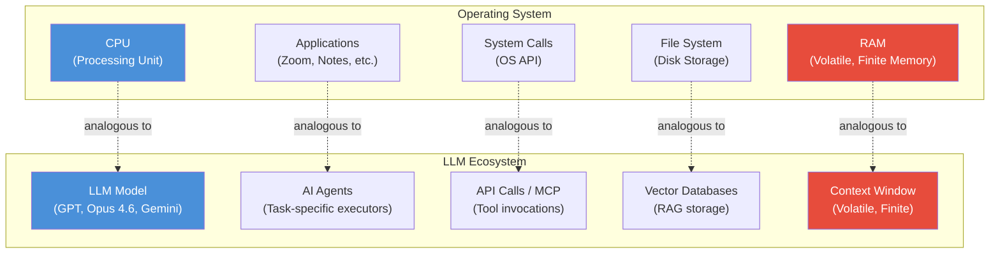
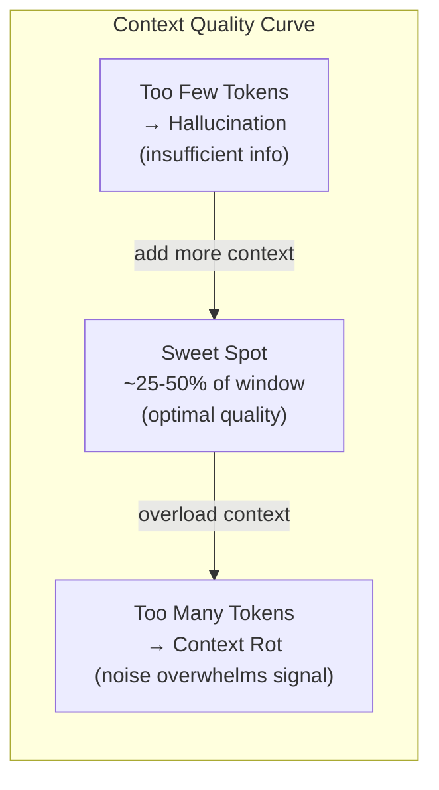
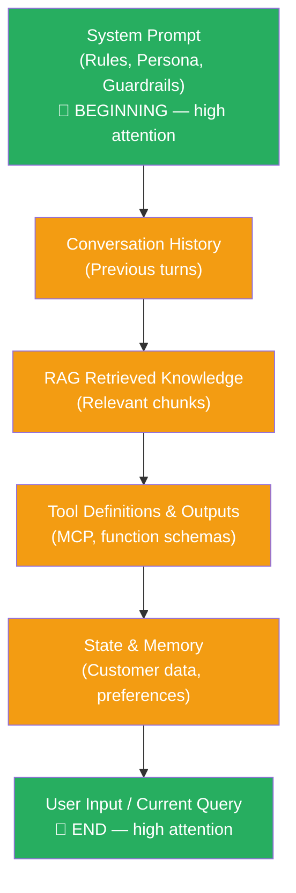
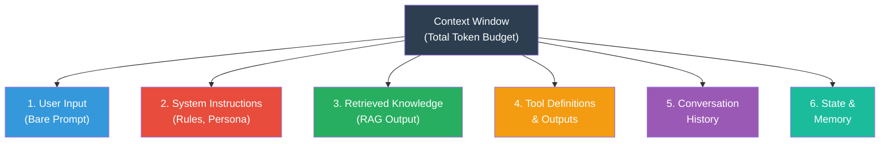
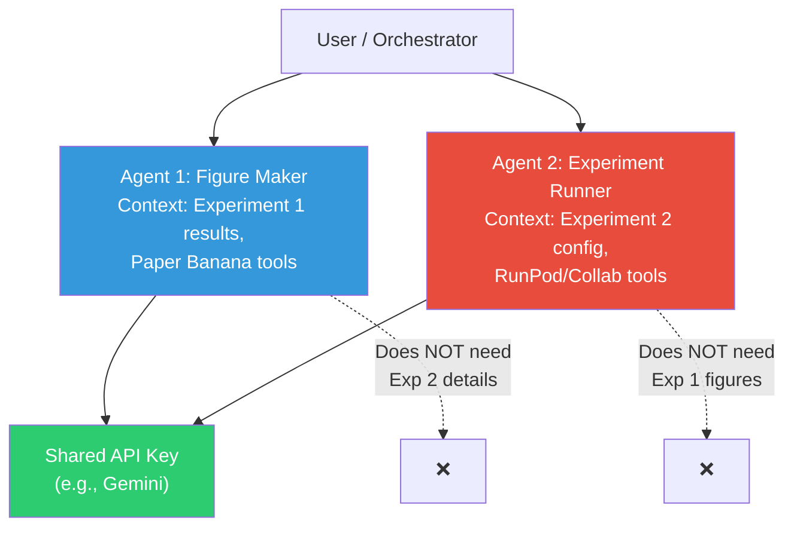
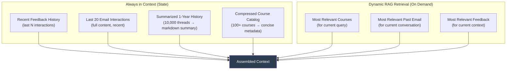

# Day 1: Introduction to LLM Context Engineering — Mental Model & The Six Core Elements

## Table of Contents

- [1. Overview](#1-overview)
- [2. Prerequisites](#2-prerequisites)
- [3. Why Context Engineering? The Motivation](#3-why-context-engineering-the-motivation)
  - [3.1 The Email Agent Case Study](#31-the-email-agent-case-study)
  - [3.2 Elements Needed for a Real-World Agent](#32-elements-needed-for-a-real-world-agent)
- [4. Prompt Engineering vs. Context Engineering](#4-prompt-engineering-vs-context-engineering)
  - [4.1 Prompt Engineering — Single-Dimensional Thinking](#41-prompt-engineering--single-dimensional-thinking)
  - [4.2 Context Engineering — Multi-Dimensional Thinking](#42-context-engineering--multi-dimensional-thinking)
  - [4.3 Comparison Table](#43-comparison-table)
  - [4.4 Vibe Coding vs. Context Engineering](#44-vibe-coding-vs-context-engineering)
- [5. The LLM OS Analogy (Andrej Karpathy)](#5-the-llm-os-analogy-andrej-karpathy)
  - [5.1 Component Mapping Diagram](#51-component-mapping-diagram)
  - [5.2 Component Mapping Table](#52-component-mapping-table)
- [6. Context Window — The RAM of an LLM](#6-context-window--the-ram-of-an-llm)
  - [6.1 Token-to-Word-to-Page Conversion](#61-token-to-word-to-page-conversion)
  - [6.2 Context Window Sizes of Major LLMs](#62-context-window-sizes-of-major-llms)
  - [6.3 Why Context Engineering Matters Despite Huge Windows](#63-why-context-engineering-matters-despite-huge-windows)
- [7. Context Rot](#7-context-rot)
  - [7.1 What Is Context Rot?](#71-what-is-context-rot)
  - [7.2 Causes of Context Rot](#72-causes-of-context-rot)
  - [7.3 The Sweet Spot — Balancing Context Size and Quality](#73-the-sweet-spot--balancing-context-size-and-quality)
- [8. Lost in the Middle Effect](#8-lost-in-the-middle-effect)
  - [8.1 The Core Finding](#81-the-core-finding)
  - [8.2 Practical Implications for Context Assembly](#82-practical-implications-for-context-assembly)
  - [8.3 Context Assembly Order Diagram](#83-context-assembly-order-diagram)
  - [8.4 Mitigation Strategies](#84-mitigation-strategies)
- [9. The Prompt Repetition Effect (Google Paper)](#9-the-prompt-repetition-effect-google-paper)
- [10. The Six Core Elements of the Context Window](#10-the-six-core-elements-of-the-context-window)
  - [10.1 Element 1: User Input (Bare Prompt)](#101-element-1-user-input-bare-prompt)
  - [10.2 Element 2: System Instructions](#102-element-2-system-instructions)
  - [10.3 Element 3: Retrieved Knowledge (RAG)](#103-element-3-retrieved-knowledge-rag)
  - [10.4 Element 4: Tool Definitions and Outputs](#104-element-4-tool-definitions-and-outputs)
  - [10.5 Element 5: Conversation History](#105-element-5-conversation-history)
  - [10.6 Element 6: State and Memory](#106-element-6-state-and-memory)
  - [10.7 Token Budget Visualization](#107-token-budget-visualization)
- [11. Hands-On Exercise: Layered Context Building](#11-hands-on-exercise-layered-context-building)
  - [11.1 The Scenario](#111-the-scenario)
  - [11.2 Progressive Layer Results](#112-progressive-layer-results)
  - [11.3 Results Summary Table](#113-results-summary-table)
  - [11.4 Scoring Methodology — LLM-as-Judge](#114-scoring-methodology--llm-as-judge)
- [12. Context Engineering vs. Agent Engineering](#12-context-engineering-vs-agent-engineering)
  - [12.1 Sub-Agent Context Isolation Diagram](#121-sub-agent-context-isolation-diagram)
- [13. Definitions of Context Engineering](#13-definitions-of-context-engineering)
- [14. Memory Architecture Patterns](#14-memory-architecture-patterns)
  - [14.1 Storage Formats](#141-storage-formats)
  - [14.2 The Email Agent Memory Stack](#142-the-email-agent-memory-stack)
- [15. Boot Camp Roadmap](#15-boot-camp-roadmap)
- [Implementation Notes](#implementation-notes)
- [Key Takeaways](#key-takeaways)
- [Glossary](#glossary)
- [Notation Reference](#notation-reference)
- [Connections to Other Topics](#connections-to-other-topics)
- [Open Questions / Areas for Further Study](#open-questions--areas-for-further-study)

---

## 1. Overview

This lecture introduces the foundational mental model for **LLM Context Engineering** — the discipline of designing, assembling, and managing everything that flows into a large language model's context window to maximize output quality. The session establishes why context engineering has become the defining skill for AI practitioners in 2025-2026, contrasts it with traditional prompt engineering, introduces the **six core elements** of the context window, and demonstrates through a hands-on exercise how each layer progressively improves LLM output quality. The lecture is delivered by Dr. Shriat Panat (PhD, MIT 2017–2022), co-founder of Vizuara.

---

## 2. Prerequisites

- Basic familiarity with Python (any level of experience)
- An API key from at least one of: **Anthropic**, **OpenAI**, or **Google (Gemini)** — minimum $5 credit is sufficient
- Conceptual understanding of what a large language model is and how it generates text (next-token prediction)
- Helpful but not required: experience with API calls / HTTP requests, working with JSON file formats

---

## 3. Why Context Engineering? The Motivation

The explosion of coding agents (Claude Code, Codex, Cursor, Copilot, OpenClaw) in 2025–2026 has revealed that **the quality of an LLM's output is primarily determined by the quality and structure of its context**, not just the user's prompt. Context engineering is the skill that separates tools that work "80% of the time" from tools that produce reliably excellent output.

### 3.1 The Email Agent Case Study

The instructor motivates the entire bootcamp with a concrete problem: building an AI agent to process and respond to ~200+ emails per day, replacing 2.5–3 hours of daily manual work. The key insight is that a simple chatbot with a user prompt is woefully inadequate — the agent needs **rich, structured, multi-dimensional context** to produce responses that match a human expert's quality.

### 3.2 Elements Needed for a Real-World Agent

From the email agent example, the following context requirements emerged:

| Element | Why It's Needed | Challenge |
|---------|----------------|-----------|
| **Website metadata** | Answer questions about courses, programs, policies | 100+ courses cannot all fit in context; need compressed metadata |
| **Email history** | Learn the user's writing style, tone, preferences | 10,000+ threads = ~250 MB of JSON; far too large for direct context |
| **Recent emails (recency bias)** | Last 20–30 emails contain the most current, accurate information | Must be prioritized over older, potentially stale data |
| **Rules / Guardrails** | Global policies (e.g., "always share course-name links, not ID links") | ~10 rules that must never be violated |
| **Feedback system** | User rates responses (1–5), edits drafts — agent learns over time | Feedback grows unboundedly; cannot load 10,000 feedback items |
| **RAG retrieval** | Fetch top-K relevant course details for a specific query | Must be low-latency, high-relevance |
| **Incoming email (user input)** | The actual message to respond to | Just one of many context elements |

> **Key insight:** The user's input (the incoming email) is a tiny fraction of the total context. Most of the context is engineering — retrieval, memory, system instructions, tool outputs — all of which must be carefully designed.

---

## 4. Prompt Engineering vs. Context Engineering

### 4.1 Prompt Engineering — Single-Dimensional Thinking

Prompt engineering is the practice of crafting a **single text input** to an LLM to maximize output quality. The user goes to a chat interface (e.g., chat.ai.com), types a request, and iterates. Key characteristics:

- Input is a **text string** — the user's natural language query
- Goal: craft text so the LLM understands your **intent**
- Only **one API call** at a time (user asks, model responds)
- Techniques: one-shot examples, few-shot examples, specifying persona, controlling output format
- Good for beginners, but fundamentally limited

### 4.2 Context Engineering — Multi-Dimensional Thinking

Context engineering encompasses **everything** that fills the LLM's context window — not just the user prompt, but system instructions, retrieved documents, tool outputs, conversation history, memory, and state. Key characteristics:

- Input is a **composite assembly** of multiple information sources
- Involves designing **dynamic systems** that assemble the right context at inference time
- Multiple API calls, tool invocations, retrieval pipelines run in concert
- Requires engineering of RAG, MCP, memory systems, guardrails
- The user prompt is just one of six (or more) elements

### 4.3 Comparison Table

| Aspect | Prompt Engineering | Context Engineering |
|--------|--------------------|---------------------|
| **Input** | Single text string | Composite multi-source assembly |
| **User's role** | Craft the perfect prompt | Design the system that assembles context |
| **Dimensions** | One (the prompt) | Six+ (system prompt, RAG, tools, memory, history, user input) |
| **API interaction** | One call at a time | Multiple calls, tools, retrieval pipelines |
| **Dynamic content** | No (static prompt) | Yes (RAG, tool outputs, live memory) |
| **Skill level** | Beginner-friendly | Requires engineering expertise |
| **Buzzword era** | 2023 | 2025–2026 |

### 4.4 Vibe Coding vs. Context Engineering

**Vibe coding** (term coined by Andrej Karpathy) refers to iteratively giving prompts to an LLM and adjusting based on output — essentially "coding by feel." The user is not writing code explicitly but sharing instructions and reacting to what the LLM produces.

**Context engineering** differs in that while the *user input* portion might involve some "vibing," the other five elements (RAG, tools, MCP, memory, system prompt) are **pure engineering** — they require deliberate, precise design:

- RAG system must have low latency and high relevance metrics
- MCP must provide access to specific backend systems
- Memory must be explicitly partitioned into persistent and short-term
- System prompts must be carefully crafted (cannot be "vibed")
- Markdown files (CLAUDE.md) must be explicitly engineered

---

## 5. The LLM OS Analogy (Andrej Karpathy)

Andrej Karpathy delivered a widely-viewed talk at Y Combinator (late 2025) where he drew an analogy between an operating system and the LLM ecosystem. This analogy provides a powerful mental model for understanding the role of each component.

### 5.1 Component Mapping Diagram

**Walkthrough:**
1. The **CPU** is the processing engine of an OS — the **LLM model** (GPT, Opus 4.6, Gemini) is the processing engine of an AI system.
2. **Applications** (Zoom, notes apps, etc.) are analogous to **AI agents** — each performs a specific task.
3. **System calls** that applications use to interact with the OS are analogous to **API calls / MCP** — the standardized interface through which agents interact with tools and external services.
4. The **file system** (disk storage loaded into RAM on demand) is analogous to **vector databases** used in RAG — persistent storage that is selectively loaded into context.
5. **RAM** is analogous to the **context window** — both are volatile (not permanent), finite (limited capacity), and serve as the working memory for active processing.

### 5.2 Component Mapping Table

| OS Component | LLM Equivalent | Key Property |
|-------------|----------------|--------------|
| CPU | LLM model (GPT, Opus, Gemini) | Core processing unit |
| Applications | AI Agents | Task-specific executors |
| System Calls | API calls / MCP (Model Context Protocol) | Standardized tool interaction |
| File System | Vector Databases (RAG storage) | Persistent, on-demand access |
| RAM | Context Window | Volatile, finite, working memory |

> **Why is context window = RAM?** Two constraints are shared: (1) RAM is not permanent memory — context window contents change with each interaction. (2) RAM is not unlimited — even a 2M token window is finite and must be managed carefully.

---

## 6. Context Window — The RAM of an LLM

### 6.1 Token-to-Word-to-Page Conversion

The fundamental unit of LLM input/output is the **token**. Understanding the relationship between tokens, words, and pages is essential for context budgeting.

**Key conversion formula:**

$$1 \text{ token} \approx \frac{3}{4} \text{ of a word} \approx 0.75 \text{ words}$$

| Symbol | Meaning | Value |
|--------|---------|-------|
| 1 token | Basic unit of LLM processing | ~0.75 words (English, BPE tokenizer) |
| 1 page | Standard page of a book | ~300 words |

**Derivation for a 2 million token context window:**

1. $2{,}000{,}000 \text{ tokens} \times 0.75 \frac{\text{words}}{\text{token}} = 1{,}500{,}000 \text{ words}$
2. $\frac{1{,}500{,}000 \text{ words}}{300 \frac{\text{words}}{\text{page}}} = 5{,}000 \text{ pages}$

**Result:** A 2 million token context window can fit approximately **5,000 pages** of text.

### 6.2 Context Window Sizes of Major LLMs

| Model | Context Window (tokens) | Approximate Pages |
|-------|------------------------|-------------------|
| GPT-4o | ~128K | ~300 pages |
| GPT-5 | Larger (unspecified) | — |
| Claude Opus | ~200K | ~500 pages |
| Gemini 2.0 Pro | ~2M | ~5,000 pages |
| Meta Llama 4 Scout | ~10M | ~28,000 pages |

### 6.3 Why Context Engineering Matters Despite Huge Windows

A natural question: if the context window can hold 5,000+ pages, why bother engineering it?

Three critical reasons:

1. **Cost** — LLM usage costs are proportional to token consumption. More tokens = higher cost per API call.
2. **Latency** — More tokens to process = slower response times.
3. **Context Rot** — Output quality **degrades** as context size increases, even before the window is full. Irrelevant tokens dilute signal-to-noise ratio.

> The analogy: saying "we don't need context engineering because the window is huge" is like saying "we don't need database management because we have 2 TB of RAM." The size of the resource makes management *more* important, not less, because increasingly complex tasks demand it.

---

## 7. Context Rot

### 7.1 What Is Context Rot?

Context rot is the **degradation of LLM output quality** caused by excessive, irrelevant, contradictory, or stale information in the context window. It occurs even when the context window is not full.

> **Anthropic's key principle:** "Find the smallest set of high-signal tokens that maximize the likelihood of your desired outcome."

Chroma published a well-regarded article with quantitative analysis showing how context rot intensifies as token count increases within the context window.

### 7.2 Causes of Context Rot

| Cause | Example | Impact |
|-------|---------|--------|
| **Stale information** | Policy from last week that has since changed | LLM uses outdated facts |
| **Contradictory instructions** | "Use font size 50" in one section, "use font size 20" in another | LLM produces inconsistent output |
| **Irrelevant context** | Loading all 100 courses when the query is about one | Signal-to-noise ratio drops |
| **Unbounded accumulation** | 15+ turns of conversation diluting system prompt | System prompt "voice" degrades over time |

> **Not a cause of context rot:** Token fragmentation from mixed encoding schemas — this is a tokenization concern, not a context quality issue.

### 7.3 The Sweet Spot — Balancing Context Size and Quality

**Walkthrough:**
- **Too few tokens:** The model lacks sufficient instructions and information, leading to hallucination and generic responses.
- **Sweet spot:** For a 200K token window, approximately 50K–100K tokens of context (25–50% of the window) produces optimal quality. The remaining capacity is reserved for model generation output.
- **Too many tokens:** Noise overwhelms signal, relevant information gets buried, contradictions emerge — output quality degrades.

> This is an **empirical** observation, not derived from physics or theory. The exact sweet spot varies by model, task, and content composition.

---

## 8. Lost in the Middle Effect

### 8.1 The Core Finding

The "Lost in the Middle" paper (2023, ~3,500 citations) demonstrated that LLMs pay **disproportionately more attention to information at the beginning and end** of the context window. Information placed in the middle of the context is more likely to be overlooked or under-weighted during generation.

Key findings:
- The effect is **more pronounced with larger context windows** (>100K tokens)
- It is an empirical observation — no definitive theoretical explanation exists, despite the fact that attention mechanisms are designed for long-range dependencies
- It applies to all major LLMs tested

> The related "Needle in a Haystack" test evaluates whether a model can attend to a single critical token placed at arbitrary positions within a large context — complementary to the "lost in the middle" finding.

### 8.2 Practical Implications for Context Assembly

The lost in the middle effect directly dictates **how to order elements within the assembled context:**

- **Critical, non-negotiable information** (system prompt, guardrails) → place at the **beginning**
- **User's current query** → place at the **end**
- **Dynamic, less-critical content** (RAG chunks, tool outputs) → fills the **middle**

The goal: **shrink the middle** so that even if some information there gets lost, nothing critical is affected.

### 8.3 Context Assembly Order Diagram

**Walkthrough:**
1. **System Prompt** is placed first (beginning of context) because it contains the persona, rules, and guardrails that must never be violated. High attention ensures the LLM consistently follows these.
2. **Conversation History** follows — earlier turns of the current interaction provide continuity.
3. **RAG Retrieved Knowledge** is assembled in the middle — relevant but dynamic content.
4. **Tool Definitions & Outputs** also in the middle — schemas for available functions and their results.
5. **State & Memory** provides customer data and session state.
6. **User Input** is placed last (end of context) to receive high attention — ensuring the model directly addresses the current query.

> If you have five RAG documents placed between the system prompt and user query, document 3 (the middle one) is most likely to be underweighted by the model.

### 8.4 Mitigation Strategies

1. **Keep the context compact** — minimize irrelevant tokens so the "middle" is small
2. **Place critical information at the extremes** — system prompt at the start, user query at the end
3. **Dynamic content in the middle** — RAG chunks, tool outputs, and other content where minor inaccuracy is tolerable
4. **Verify tool results independently** — use separate validation agents to catch any hallucination from middle-positioned content
5. **Critical guardrails should never be in the middle** — e.g., "never write to the database without explicit permission" must be at start or end

---

## 9. The Prompt Repetition Effect (Google Paper)

A recent Google paper demonstrated that **repeating the exact same prompt twice** in the context significantly improves LLM output quality, at the cost of doubling token consumption.

**Mechanism:** The duplicated prompt reinforces the instructions in the attention mechanism, causing the model to attend more strongly to the user's intent. The attention weights are constructed such that when a prompt appears only once, the LLM cannot carry the information as efficiently as when the same tokens appear twice.

**Trade-off:**

| Metric | Effect |
|--------|--------|
| Token consumption | 2x (doubled) |
| Cost | 2x (doubled) |
| Output quality | Significantly improved |

> **Practical tip from the instructor:** Try repeating your prompt 2x or 3x and observe the quality improvement versus cost increase. This is an easy experiment to run.

---

## 10. The Six Core Elements of the Context Window

The context window is a **finite sequence of tokens** that the LLM processes. These tokens come from six distinct sources, each serving a different purpose. Together, they form the complete input to the model.

**Walkthrough:** The context window has a fixed token budget (e.g., 128K, 200K, 2M tokens). Each of the six elements consumes a portion of that budget. Context engineering is the art of filling this budget with the highest-signal tokens from each element.

### 10.1 Element 1: User Input (Bare Prompt)

- **What it is:** The current query or instruction from the end user
- **Typical size:** ~100–500 tokens (one paragraph)
- **Position in context:** End (to receive high attention)
- **Key property:** This is the only element the user controls; it cannot be "engineered" by the developer — you cannot ask a customer to learn prompt engineering
- **Example:** "Based on the past conversation, the portal just gave me the same error. I called your support line and sat on hold for 45 minutes before I got disconnected..."

### 10.2 Element 2: System Instructions

- **What it is:** The developer-crafted instructions that define the LLM's persona, rules, guardrails, and behavioral constraints
- **Typical size:** ~200–2,000 tokens
- **Position in context:** Beginning (to receive high attention)
- **Stored as:** CLAUDE.md files (Claude Code), system prompt field in API calls, markdown files
- **Example:** "You are Alex, a senior resolution specialist at NovaTech Electronics. You have 8 years of experience and authority to approve resolutions up to $2,000 without manager approval. Rules: Always lead with empathy. Use the customer's first name. Never say 'I can't' or 'that's not possible.'"
- **Tomorrow's lecture (Day 2)** dives deep into crafting effective system prompts

### 10.3 Element 3: Retrieved Knowledge (RAG)

- **What it is:** Relevant documents/chunks fetched from a knowledge base via a Retrieval-Augmented Generation pipeline
- **Typical size:** ~600–8,000 tokens (depending on chunk count and size)
- **Position in context:** Middle
- **Pipeline:** Documents → Chunking → Embedding → Vector Store → Query → Top-K Retrieval → Reranking → Context Assembly
- **Example:** Company policy documents, product specifications, return/refund policies
- **Key calculation:** If 8,000 tokens are allocated for RAG and there are 10 chunks, each chunk is ~800 tokens ≈ ~1 page of text
- **Day 3** is dedicated to RAG

### 10.4 Element 4: Tool Definitions and Outputs

- **What it is:** JSON schemas describing available tools (functions the LLM can call) and the results returned from those tool calls
- **Typical size:** ~200–500 tokens for definitions; variable for outputs
- **Position in context:** Middle
- **Format:** Structured JSON, not paragraphs
- **Example tools:** `lookup_order(order_id)`, `process_replacement(order_id, reason)`, `issue_refund(order_id, amount)`, `issue_service_credit(customer_id, amount)`
- **Via MCP (Model Context Protocol):** Standardized way for LLMs to interact with tools (e.g., Slack MCP, database MCP, finance MCP)

> **Warning (from discussion):** Having 50+ tool descriptions in the context can bloat it significantly — tool descriptions alone can overwhelm the rest of the context.

- **Day 4** covers MCP in detail

### 10.5 Element 5: Conversation History

- **What it is:** Previous turns of user–assistant interaction within the current session
- **Typical size:** ~500–10,000 tokens (grows with conversation length)
- **Position in context:** Between system prompt and user input
- **Format:** Alternating `user:` / `assistant:` messages
- **Key issue:** After 15+ turns, the accumulated history can dilute the system prompt, causing the bot to lose its persona and become "blunt and robotic"
- **Solution:** Compaction — summarize older turns, keep recent turns verbatim

### 10.6 Element 6: State and Memory

- **What it is:** Persistent and session-specific information about the user, their history, preferences, and current situation
- **Typical size:** ~200–1,000 tokens
- **Position in context:** Middle (before user input)
- **Example:** "Customer: Marcus Chen. Tier: Platinum (lifetime spend: $12,847). Satisfaction level: at-risk. Current issue: defective headphones, $189.99."
- **Two types of memory:**
  - **Persistent memory:** Long-term preferences, writing style, summarized email history (stored as markdown files)
  - **Short-term memory:** Recent interactions, current session state (stored as JSON or markdown)
- **Day 6** covers memory systems in depth

### 10.7 Token Budget Visualization

From the exercise, a typical token budget breakdown:

| Element | Tokens | % of Total (~1,900) |
|---------|--------|---------------------|
| User Input | ~110 | ~6% |
| System Instructions | ~330 | ~17% |
| RAG Knowledge | ~600 | ~32% |
| Tool Definitions | ~300 | ~16% |
| Conversation History | ~350 | ~18% |
| State & Memory | ~210 | ~11% |

> **Critical observation:** The user's prompt (what prompt engineering optimizes) is only ~6% of the total context. The remaining 94% is what context engineering manages.

---

## 11. Hands-On Exercise: Layered Context Building

### 11.1 The Scenario

A customer support chatbot for **NovaTech Electronics** handling a frustrated customer:

- **Customer:** Marcus Chen — premium/platinum customer with $12,400+ lifetime purchases
- **Issue:** Defective $189.99 headphones (left ear crackling), purchased within the last month
- **Frustration factors:** Self-service portal errors, 45-minute hold time with disconnection, third attempt at resolution
- **Customer's state:** "Absolutely livid," threatening credit card dispute

### 11.2 Progressive Layer Results

The exercise progressively adds context layers to observe how each improves output quality:

**Layer 1 — User Input Only (110 tokens):**
- Output: Generic apology, lots of "fluff," no actionable steps
- Asks for order number (already provided earlier in conversation history it doesn't have)
- Actionability: 0/5
- Score: ~18/40

**Layer 2 — + System Instructions (744 tokens):**
- Output: Introduces itself as "Alex, senior resolution specialist"
- Follows some persona rules (empathy, name usage)
- Still no knowledge of policies or refund authority
- Score: ~23/40

**Layer 3 — + Retrieved Knowledge / RAG (1,262 tokens):**
- Output: References actual return policies, product-specific information
- Policy accuracy improves (no restocking fee for defective items)
- Context awareness improves significantly
- Score: ~28/40

**Layer 4 — + Tool Definitions (1,562 tokens):**
- Output: Longer, more detailed response with specific resolution options
- Hallucination: 0 (5/5 — no policy hallucination detected)
- LLM knows it *can* call `process_replacement`, `issue_refund`, etc.
- Score: ~30/40

**Layer 5 — + Conversation History (~1,700 tokens):**
- Output: References prior troubleshooting steps, acknowledges the customer's journey
- No longer asks for already-provided information
- Continuity across the conversation
- Score: ~31/40

**Layer 6 — + State & Memory (~1,900 tokens):**
- Output: Recognizes Marcus as platinum customer, offers premium-tier resolution
- Personalizes the response based on customer history and loyalty
- Score: ~31–33/40

### 11.3 Results Summary Table

| Layers Included | Tokens | Score (/40) | Key Improvement |
|----------------|--------|-------------|-----------------|
| User only | 110 | ~18 | Baseline — generic, useless |
| + System instructions | 744 | ~23 | Persona established |
| + RAG knowledge | 1,262 | ~28 | Policy-accurate responses |
| + Tool definitions | 1,562 | ~30 | Actionable, no hallucination |
| + Conversation history | ~1,700 | ~31 | Context-aware continuity |
| + State & memory | ~1,900 | ~31–33 | Personalized, premium-tier |

> **Important caveat:** Scores are not perfectly monotonic on every run. LLMs produce different outputs on different calls. The trend is consistent on average, but individual runs may show slight regressions. This is expected — LLMs are not deterministic.

### 11.4 Scoring Methodology — LLM-as-Judge

The exercise uses a second API call (same LLM model) as a **judge** to grade the primary response. The judge receives:
- The full context (all six layers)
- The response to be graded
- Grading criteria: empathy/tone, context awareness, policy accuracy, hallucination detection, personalization, actionability, completeness

**Grading dimensions (8 criteria, 5 points each = 40 total):**

| Criterion | What It Measures |
|-----------|-----------------|
| Empathy & Tone | Does the response lead with empathy, acknowledge frustration? |
| Context Awareness | Does it use information from conversation history? |
| Policy Accuracy | Are refund/return policies correctly cited? |
| Hallucination | Does it fabricate non-existent policies? |
| Personalization | Does it recognize the customer's tier/history? |
| Actionability | Does it offer concrete next steps? |
| Completeness | Does it address all customer complaints (defect, portal, hold)? |
| Persona Adherence | Does it follow system prompt rules (name, ownership, framing)? |

> **Limitation:** LLM-as-judge is not 100% consistent across calls. There is inherent variability. A human judge would be more reliable but slower.

---

## 12. Context Engineering vs. Agent Engineering

Context engineering and agent engineering are related but distinct:

- **Agent engineering:** Define agents, their tools, skills, and output formats. Agents can execute tasks autonomously.
- **Context engineering:** Manage what information each agent (or the overall system) receives in its context window. This is required *regardless* of whether you use agents or not.

Key distinction: When you have **multiple agents** (sub-agents), each agent gets its **own context window**. Context engineering determines what goes into each agent's context independently.

### 12.1 Sub-Agent Context Isolation Diagram

**Walkthrough:**
1. Two agents share the same API key but have **separate context windows**.
2. Agent 1 (figure-making) only needs Experiment 1 results and Paper Banana tools in its context.
3. Agent 2 (experiment runner) only needs Experiment 2 configuration and compute tools.
4. Loading Experiment 2 details into Agent 1's context would be wasteful and could cause context rot.
5. Each agent's context is independently engineered for its specific task.

> **In Claude Code:** Sub-agents automatically get their own context window, so whatever is happening in one session doesn't pollute another's context. However, one sub-agent may produce poor results if *its* context exceeds the optimal limit, even while another sub-agent performs well.

---

## 13. Definitions of Context Engineering

Three influential definitions, each capturing a different facet:

| Source | Definition | Emphasis |
|--------|-----------|----------|
| **Andrej Karpathy** (former OpenAI) | "The delicate art and science of filling the context window with just the right information for the next step." | Art + science; minimalism; step-by-step |
| **Toby Lutke** (CEO, Shopify) | "The art of providing all the context for the task to be possibly solved by the LLM." | Completeness; task-centric |
| **Harrison Chase** (CEO, LangChain) | "Building dynamic systems to provide the right info and tools in the right format." | Systems engineering; dynamic assembly; format matters |
| **Anthropic** (key principle) | "Find the smallest set of high-signal tokens that maximize the likelihood of your desired outcome." | Minimalism; signal-to-noise; outcome-focused |

---

## 14. Memory Architecture Patterns

### 14.1 Storage Formats

Memory in LLM applications is stored primarily in two formats:

| Format | Use Case | Example |
|--------|----------|---------|
| **Markdown (.md)** | System prompts, rules, preferences, summaries | CLAUDE.md, memory.md |
| **JSON** | Structured data (email threads, customer records) | email_history.json |
| **XML** | Some system configurations | Older format, less common now |

> **Common pattern:** Store structured data as JSON, then create a markdown metadata summary of that JSON for context loading. The full JSON is too large for context, but the markdown summary fits.

### 14.2 The Email Agent Memory Stack

The instructor's email reply agent uses a layered memory architecture:

**Walkthrough:**
1. **Static state** is always loaded: recent feedback, last 20 emails (high recency value), compressed summary of all historical emails, and compressed course catalog.
2. **Dynamic RAG** fetches additional relevant content on demand: the most relevant courses for the current query, the most relevant past email for conversational context, and the most relevant feedback entries.
3. This two-tier architecture (static state + dynamic retrieval) balances comprehensive context with manageable token budgets.
4. The 250 MB of raw JSON email data is never loaded directly — only the compressed summary and dynamically retrieved relevant emails enter the context.

---

## 15. Boot Camp Roadmap

| Session | Day | Topic |
|---------|-----|-------|
| 1 | Mon (today) | Mental model — six core elements of context |
| 2 | Tue | System prompts (CLAUDE.md, right altitude principle) |
| 3 | Wed | RAG pipeline |
| 4 | Thu | MCP (Model Context Protocol) |
| 5 | Mon (next week) | Context compaction and clearing strategies |
| 6 | Tue | Memory systems (persistent + short-term) |
| 7 | Wed | Production patterns and evaluation |
| 8 | Thu | Build project (mega project) |
| 9 | TBD | Mega project with Dr. Raj (3-hour session) |
| 10 | TBD | Mega project with Dr. Rajat (3-hour session) |

**Frameworks covered across the bootcamp:**
- LLM OS Analogy (Karpathy)
- Right / Select / Compress / Isolate framework
- Right Altitude Principle (Anthropic)
- Product Requirements Prompt
- ReAct (Reasoning and Acting) Framework
- Token Budgeting
- Memory Types (Persistent, Short-term, Episodic)

---

## Implementation Notes

- **API Keys:** Exercises work with Anthropic, OpenAI, or Gemini API keys. $5–$15 credit is sufficient for the entire bootcamp.
- **Interactive Website:** The instructor built an interactive web notebook (non-Python) that abstracts code away — accessible to non-coders. A separate Google Colab notebook provides the Python implementation.
- **Google Colab:** Used for hands-on exercises. Code supports all three API providers (Anthropic, OpenAI, Gemini) with slight differences in function calling patterns.
- **Claude Code + Opus 4.6:** The instructor's primary development tool. Requires the $20/month Anthropic plan (not free tier). Recommended for all participants.
- **Claude Code commands:** `/clear` (switch tasks — completely clears context), `/compact` (compress context to reduce tokens while preserving information). Use `/compact` frequently when switching between tasks within the same project.
- **Claude-Mem GitHub repo:** A plug-in for Claude Code that manages memory between sessions — recommended for efficient context utilization.
- **Paper Banana:** A tool built on Nano Banana for creating research-paper-quality figures using an agentic framework.
- **OpenClaw:** One of the fastest-growing GitHub repositories — an agent framework for building personalized AI agents. Use with caution on personal machines due to data exposure concerns.

---

## Key Takeaways

- **Context engineering is the successor to prompt engineering.** In 2023, the buzzword was prompt engineering; in 2025–2026, it is context engineering. The user's prompt is just ~6% of the total context — the other 94% is what you engineer.
- **The context window is the LLM's RAM** — volatile, finite, and must be managed carefully regardless of size.
- **There are six core elements of the context:** user input, system instructions, retrieved knowledge (RAG), tool definitions/outputs, conversation history, and state/memory. Each progressively improves output quality.
- **Context rot is the central enemy.** Output quality degrades with excessive tokens, even before the window is full. The Anthropic principle applies: find the *smallest* set of high-signal tokens.
- **The "lost in the middle" effect** means critical information (system prompts, guardrails) must be placed at the beginning or end of the context, never buried in the middle.
- **Repeating the prompt twice** (Google paper) significantly improves output quality at the cost of doubling token consumption — a simple but effective trade-off.
- **The sweet spot for a 200K context window is approximately 50K–100K tokens** — enough for comprehensive context without rot, with room for generation output.
- **Sub-agents get isolated context windows.** When using multi-agent systems, each agent should receive only the context relevant to its specific task.
- **Memory should be layered:** compressed historical summaries always in context + dynamic RAG retrieval for query-specific information.
- **System prompts stored as markdown files (CLAUDE.md) are the starting point** for any context engineering effort — tomorrow's topic.

---

## Glossary

| Term | Definition | First Introduced |
|------|-----------|-----------------|
| **Context Window** | The total input token capacity of an LLM — all text (system prompt, user input, history, etc.) that the model processes at inference time | Section 5 |
| **Context Rot** | Degradation of LLM output quality caused by excessive, irrelevant, or contradictory tokens in the context | Section 7 |
| **Context Engineering** | The discipline of designing and managing all information that flows into an LLM's context window to maximize output quality | Section 4 |
| **Prompt Engineering** | The practice of crafting a single user text input to an LLM for optimal results | Section 4 |
| **Vibe Coding** | Iterative, feeling-based interaction with an LLM to produce code, without explicit programming (coined by Karpathy) | Section 4.4 |
| **Lost in the Middle Effect** | The empirical finding that LLMs under-attend to information in the middle of the context window | Section 8 |
| **Needle in a Haystack** | A test evaluating whether an LLM can attend to a single critical token at an arbitrary position in a large context | Section 8 |
| **Token** | The fundamental unit of LLM input/output; ~0.75 English words using BPE tokenization | Section 6 |
| **RAG (Retrieval-Augmented Generation)** | A pipeline that retrieves relevant documents from a knowledge base and includes them in the LLM context | Section 10.3 |
| **MCP (Model Context Protocol)** | A standardized protocol for LLMs to interact with external tools and services | Section 10.4 |
| **System Prompt** | Developer-crafted instructions defining the LLM's persona, rules, and behavior; stored as CLAUDE.md in Claude Code | Section 10.2 |
| **LLM-as-Judge** | Using a separate LLM API call to evaluate/grade another LLM's output against defined criteria | Section 11.4 |
| **BPE (Byte Pair Encoding)** | A tokenization algorithm that splits text into subword units; standard in modern LLMs | Section 6.1 |
| **Sub-Agent** | An agent spawned by another agent with its own isolated context window for parallel task execution | Section 12 |
| **OpenClaw** | An open-source agent framework for building personalized AI agents (fast-growing GitHub repo) | Section 3 |
| **Paper Banana** | A figure-making tool built on Nano Banana for research paper quality visuals | Section 12 |
| **Context Compaction** | The process of summarizing/compressing context to free up tokens while preserving information (/compact in Claude Code) | Section 6 |

---

## Notation Reference

| Symbol | Meaning |
|--------|---------|
| 1 token | ~0.75 English words (BPE) |
| 1 page | ~300 words |
| K | Thousand (e.g., 128K = 128,000) |
| M | Million (e.g., 2M = 2,000,000) |
| Top-K | The K highest-ranked items from retrieval |

---

## Connections to Other Topics

- **Day 2 (System Prompts):** Deep dive into crafting effective system instructions — the "right altitude" principle from Anthropic, CLAUDE.md files, and how to write rules that resist context rot.
- **Day 3 (RAG):** Full pipeline for retrieval-augmented generation — chunking strategies, embedding models, retrieval, reranking, and context assembly.
- **Day 4 (MCP):** Model Context Protocol — standardized tool interaction, building MCP servers, managing tool description overhead.
- **Day 5 (Context Compaction):** How Claude Code handles context compression (/compact), when to clear context (/clear), and strategies for long-running sessions.
- **Day 6 (Memory):** Persistent vs. short-term memory, memory between sessions, the claude-mem plugin.
- **Day 7 (Production Patterns):** Evaluation metrics, production deployment, quality measurement.
- **Attention Mechanism:** The lost in the middle effect relates to how self-attention weights are distributed across the context — a deeper understanding of transformer attention would explain why middle tokens receive less weight.
- **ReAct Framework:** Reasoning + Acting pattern for agents, where context engineering determines what information the agent has at each reasoning step.

---

## Open Questions / Areas for Further Study

1. **Why does the lost in the middle effect occur mechanistically?** Attention mechanisms are designed for long-range dependencies, yet empirically, middle tokens are underweighted. No satisfying theoretical explanation exists.
2. **How does the quality curve extrapolate beyond 200K tokens?** The sweet spot of 25–50% is empirical for ~200K windows. Does this ratio hold for 2M or 10M token windows? Experiments are needed.
3. **Prompt repetition — why does it work?** The Google paper shows repeating prompts 2x improves quality, but the mechanism (attention reinforcement?) is not fully understood.
4. **How to systematically optimize context assembly order?** Beyond the heuristic of "critical info at the edges," is there an automated way to find the optimal ordering for a given task?
5. **Context rot measurement:** How to quantitatively detect context rot in production systems before output quality degrades? The Chroma article provides some metrics, but standardized benchmarks are lacking.
6. **Read the following recommended papers/articles:**
   - "Lost in the Middle" paper (2023, ~3,500 citations) — search "lost in the middle LLM"
   - Chroma's article on context rot — search "chroma context rot"
   - Google's prompt repetition paper (2025) — "repeating the prompt twice Google"
   - Matt Schumer's viral article on AI changes (~85M impressions)
   - Needle in a Haystack blog article
