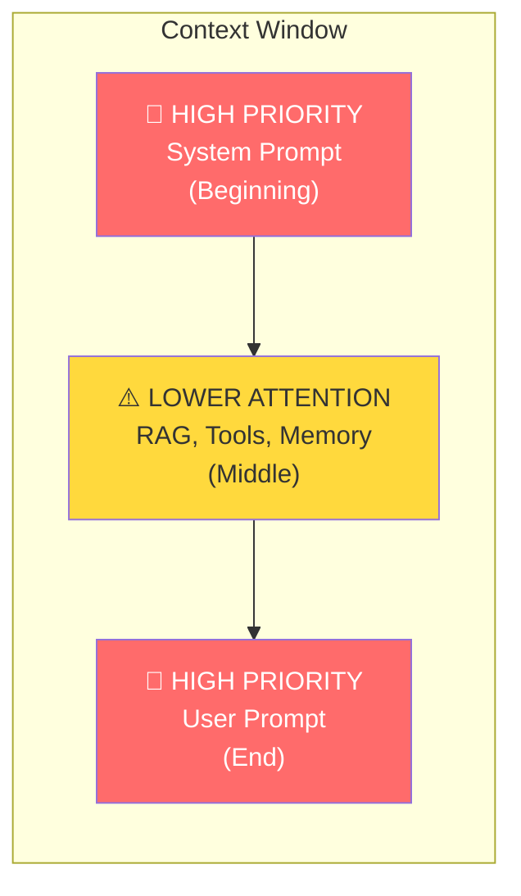
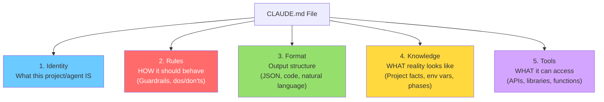
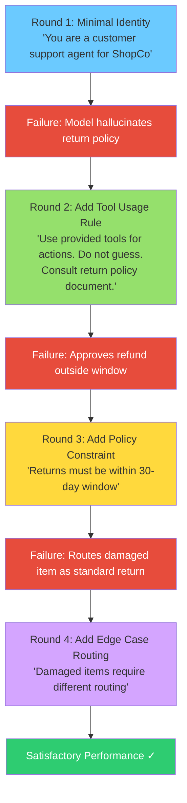
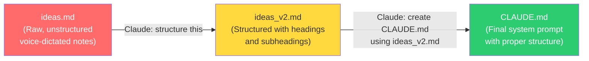
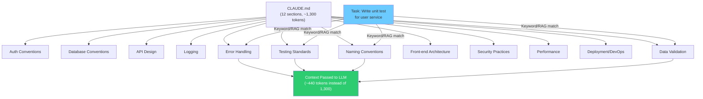
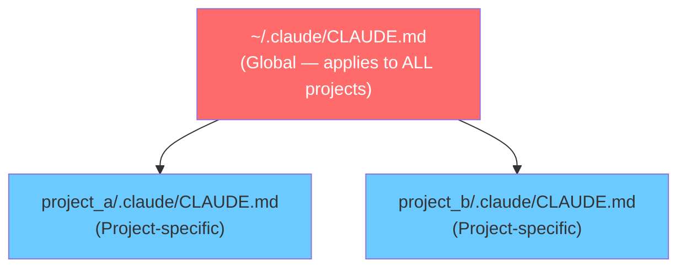
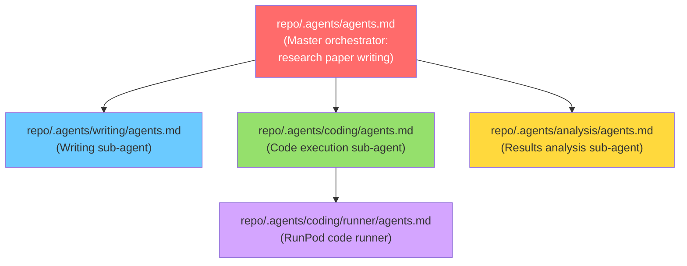
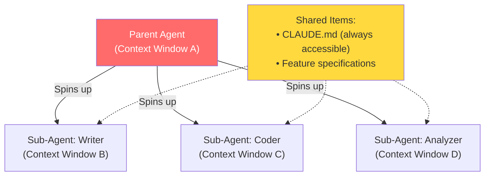
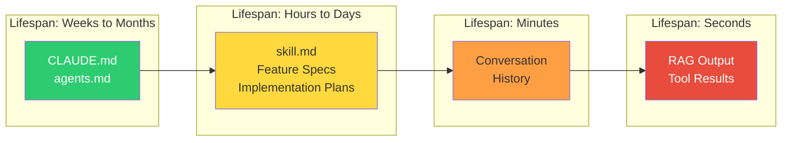

# Day 2: System Prompts and CLAUDE.md — The Foundation of Context Engineering

## Table of Contents

- [1. Overview](#1-overview)
- [2. Prerequisites](#2-prerequisites)
- [3. Recap: The Six Layers of Context](#3-recap-the-six-layers-of-context)
  - [3.1 Memory vs. Conversation History](#31-memory-vs-conversation-history)
  - [3.2 Context Ordering and the Lost-in-the-Middle Effect](#32-context-ordering-and-the-lost-in-the-middle-effect)
- [4. Anatomy of a System Prompt (CLAUDE.md)](#4-anatomy-of-a-system-prompt-claudemd)
  - [4.1 Identity](#41-identity)
  - [4.2 Rules](#42-rules)
  - [4.3 Format](#43-format)
  - [4.4 Knowledge](#44-knowledge)
  - [4.5 Tools](#45-tools)
  - [4.6 Blurred Boundaries Between Components](#46-blurred-boundaries-between-components)
- [5. Right Altitude Principle](#5-right-altitude-principle)
  - [5.1 Too High (Too Vague)](#51-too-high-too-vague)
  - [5.2 Too Low (Too Brittle)](#52-too-low-too-brittle)
  - [5.3 Right Altitude Examples](#53-right-altitude-examples)
- [6. System Prompt Formatting: XML vs. Markdown](#6-system-prompt-formatting-xml-vs-markdown)
- [7. Iterative Construction: Start Minimal, Then Add](#7-iterative-construction-start-minimal-then-add)
  - [7.1 The Sequential Build Process](#71-the-sequential-build-process)
  - [7.2 Avoiding Contradictions](#72-avoiding-contradictions)
- [8. CLAUDE.md Construction Workflow](#8-claudemd-construction-workflow)
  - [8.1 Raw Ideas to Structured Ideas to CLAUDE.md](#81-raw-ideas-to-structured-ideas-to-claudemd)
  - [8.2 CLAUDE.md Lifespan and Stability](#82-claudemd-lifespan-and-stability)
  - [8.3 CLAUDE.md Size Guidelines](#83-claudemd-size-guidelines)
- [9. Selective Section Retrieval from CLAUDE.md](#9-selective-section-retrieval-from-claudemd)
  - [9.1 How Retrieval Works](#91-how-retrieval-works)
  - [9.2 RAG-Based vs. Keyword-Based Retrieval](#92-rag-based-vs-keyword-based-retrieval)
- [10. File Hierarchy: CLAUDE.md, agents.md, and skill.md](#10-file-hierarchy-claudemd-agentsmd-and-skillmd)
  - [10.1 CLAUDE.md (Project-Level and Global)](#101-claudemd-project-level-and-global)
  - [10.2 agents.md (Sub-Agent Definitions)](#102-agentsmd-sub-agent-definitions)
  - [10.3 skill.md (Capability Definitions)](#103-skillmd-capability-definitions)
  - [10.4 soul.md](#104-soulmd)
  - [10.5 Hierarchy Resolution and Override Rules](#105-hierarchy-resolution-and-override-rules)
- [11. Sub-Agents and Context Window Isolation](#11-sub-agents-and-context-window-isolation)
- [12. Context Lifespan Hierarchy](#12-context-lifespan-hierarchy)
- [13. Few-Shot Examples in System Prompts](#13-few-shot-examples-in-system-prompts)
  - [13.1 Classification Tasks — Input/Output Pairs](#131-classification-tasks--inputoutput-pairs)
  - [13.2 Reasoning Tasks — Chain-of-Thought Examples](#132-reasoning-tasks--chain-of-thought-examples)
  - [13.3 Structured Output Tasks — Prefix/Suffix Examples](#133-structured-output-tasks--prefixsuffix-examples)
  - [13.4 Static vs. Dynamic Example Selection](#134-static-vs-dynamic-example-selection)
  - [13.5 Diversity Principle](#135-diversity-principle)
- [14. Exercises and Demonstrations](#14-exercises-and-demonstrations)
  - [14.1 Exercise 1: Student Grade Calculator — With vs. Without CLAUDE.md](#141-exercise-1-student-grade-calculator--with-vs-without-claudemd)
  - [14.2 Exercise 2: Sequential Chatbot Construction (Rounds 1–4)](#142-exercise-2-sequential-chatbot-construction-rounds-14)
  - [14.3 Exercise 3: Few-Shot Intelligence — Baseline, Static, Dynamic](#143-exercise-3-few-shot-intelligence--baseline-static-dynamic)
  - [14.4 Exercise 4: Selective Section Retrieval Visualization](#144-exercise-4-selective-section-retrieval-visualization)
- [15. Coding Agents vs. LLMs: A Key Distinction](#15-coding-agents-vs-llms-a-key-distinction)
- [16. Platform-Specific Configuration Files](#16-platform-specific-configuration-files)
- [17. Production Deployment Considerations](#17-production-deployment-considerations)
- [18. Poorly Designed vs. Well-Designed CLAUDE.md](#18-poorly-designed-vs-well-designed-claudemd)
- [19. Quiz Insights and Key Takeaways](#19-quiz-insights-and-key-takeaways)
- [Implementation Notes](#implementation-notes)
- [Key Takeaways](#key-takeaways)
- [Glossary](#glossary)
- [Notation Reference](#notation-reference)
- [Connections to Other Topics](#connections-to-other-topics)
- [Open Questions / Areas for Further Study](#open-questions--areas-for-further-study)

---

## 1. Overview

This lecture (Day 2 of the Context Engineering Bootcamp) focuses on **system prompts** — the foundational layer of context provided to large language models. The primary vehicle for system prompts in Claude Code is the **CLAUDE.md** file. The lecture covers the five components of a well-structured system prompt (identity, rules, format, knowledge, tools), the "right altitude" principle for writing instructions, iterative construction methodology, selective retrieval of sections, the file hierarchy (CLAUDE.md, agents.md, skill.md, soul.md), few-shot example strategies, and hands-on exercises demonstrating the quantitative difference between prompting with and without a structured system prompt.

---

## 2. Prerequisites

- Familiarity with the six layers of context from Day 1 (system prompt, user instructions, tools, memory/state, RAG, conversation history)
- Basic understanding of LLM API calls (sending a prompt, receiving a completion)
- Markdown syntax (headings, subheadings, lists)
- Familiarity with Claude Code or a similar coding agent is helpful but not required

---

## 3. Recap: The Six Layers of Context

Day 1 established the six elements that constitute the context provided to an LLM:

1. **System Prompt** — rules, guardrails, identity (CLAUDE.md / agents.md)
2. **User Instructions** — the direct prompt or query from the user
3. **Tools** — functions, APIs, libraries accessible to the model (MCP)
4. **Memory / State** — persistent knowledge (preferences, historical patterns)
5. **RAG** — dynamically fetched data from knowledge bases
6. **Conversation History** — the current session's message exchanges

> These six elements are not listed in any particular priority order. The *order in which they appear in the context window* is what matters.

### 3.1 Memory vs. Conversation History

A common point of confusion: memory and conversation history are **not** the same thing.

| Aspect | Conversation History (Session Memory) | Memory / State (Persistent Memory) |
|--------|---------------------------------------|-------------------------------------|
| **Scope** | Current conversation thread only | Across all conversations and sessions |
| **Lifespan** | Exists for duration of one session | Persists for weeks, months, or indefinitely |
| **Content** | The 25 email exchanges in a thread | Your email preferences over the past year |
| **Example** | "What was said 3 messages ago?" | "This user prefers formal tone in technical emails" |
| **Storage** | Context window | Memory markdown files, databases, knowledge bases |

**Concrete example**: An email agent responding to a thread. The 25 prior exchanges in that specific thread form the **conversation history**. How the user has replied to technical vs. non-technical emails over the past year, distilled from 5,000–10,000 email exchanges, forms the **persistent memory/state**.

### 3.2 Context Ordering and the Lost-in-the-Middle Effect

The context window has a well-documented attention bias:



**Walkthrough**: LLMs give the most prominence to the **beginning** and **end** of the context window. Content in the middle receives slightly less attention — this is the "lost in the middle" effect. This is why:

- **System prompt** (rules, guardrails) goes at the **beginning** — highest priority
- **User prompt** goes at the **end** — also high priority
- Everything else (RAG output, tool results, memory) sits in the **middle**

> **Practical guideline**: Even if an LLM supports 1–2 million tokens as its context window, try to keep your actual context length to **50,000–100,000 tokens**. Larger contexts amplify the lost-in-the-middle effect.

---

## 4. Anatomy of a System Prompt (CLAUDE.md)

A CLAUDE.md file typically contains five components. These form the skeleton of any well-structured system prompt.



**Walkthrough**: The CLAUDE.md file is decomposed into five logical components. Identity defines what the project is. Rules define behavioral guardrails and are the highest priority — if you must cut sections due to token constraints, rules should be the **last** thing removed. Format specifies output structure. Knowledge provides factual context about the application. Tools declare available APIs and libraries.

### 4.1 Identity

Identity describes **what the project is** — not in anthropomorphic terms ("you are a senior code reviewer"), but in functional terms.

**Good examples**:
- "This is an email responding agent"
- "This is a personal digital clone for responding to Slack messages"
- "This is a website that automatically updates when new developments happen in the AI space"

**Key point**: Identity does not mean "who the LLM is." It means what the thing you are building is meant to do. Avoid giving human-like personas unless specifically needed.

**Token characteristics**: Identity is typically one paragraph — it consumes the fewest tokens of all five components. If forced to cut sections, identity is the **safest to remove first** because the model can often infer its role from the rules, examples, and conversation context.

### 4.2 Rules

Rules define **how** the model should or should not behave. These are the guardrails.

**Examples**:
- "Never respond about refund policy without consulting the policy document"
- "Never use camelCase — use snake_case"
- "Never store student scores with more than two decimal places"
- "If a customer asks about returns, consult the return policy document before responding"

**Priority**: Rules are the **highest priority** component. Even under extreme token constraints, rules should be the last component removed. Rules must be loaded into the context for every single API call because guardrails should never be broken.

**Rules vs. Knowledge distinction**:
- **Rules** = how to do something (behavioral directives)
- **Knowledge** = what something is or what reality looks like (factual descriptions)

> **Rule of thumb**: If it says "never do X" or "always do Y" — it's a rule. If it describes what exists or how things are structured — it's knowledge.

### 4.3 Format

Format specifies **how the LLM should structure its output**.

This includes:
- Output format (Python code, JSON, natural language, CSV)
- Project folder structure (directory tree showing where files go)
- Development commands (`npm run dev`, `npm run build`)

**Example**: A project structure definition:
```
src/
├── calculator.py  # calculate_final_grade function
├── models.py      # data classes
├── utils/
└── tests/
```

By providing this format in CLAUDE.md, you reinforce the structure you want the project to follow and ensure the LLM knows where files are located.

### 4.4 Knowledge

Knowledge describes **what the reality of the application is** — factual information the model needs.

**Examples**:
- Environment variables and how they are structured
- Development phases (Phase 1: MVP, Phase 2: Multi-user)
- Tech stack details (Python, ChromaDB, LangChain)
- How the project overview describes the application

**Key point**: Knowledge is not about behavior — it's about facts. "The system uses PostgreSQL for data storage" is knowledge. "Always use parameterized queries" is a rule.

### 4.5 Tools

Tools define **what the model can access** — APIs, libraries, packages, and functions.

**Examples**:
- "Use Claude API for LLM calls"
- "ChromaDB for vector storage"
- "LangChain or LlamaIndex for orchestration"
- "CSV.writer for export operations"

### 4.6 Blurred Boundaries Between Components

The boundaries between components are **fluid, not rigid**:

| Boundary | Example | Why It's Ambiguous |
|----------|---------|-------------------|
| Rules ↔ Knowledge | "Start with cosine similarity" | Is this a rule (how to do retrieval) or knowledge (what method to use)? |
| Knowledge ↔ Tools | Tech stack section listing Python, ChromaDB | Defines both what tools to use AND knowledge about the stack |
| Rules ↔ Format | Development commands (`npm run dev`) | Specifies both how to run the project AND the format of operations |
| Knowledge ↔ Format | Project folder structure | Describes what exists AND specifies output structure |

> Context engineering is **not physics** — it is more like a collection of thumb rules that evolved from experimentation by large companies and communities. The boundaries between knowledge, rules, and format are deliberately soft.

---

## 5. Right Altitude Principle

Anthropic's key principle for writing CLAUDE.md instructions: instructions should be written at the **right altitude** — neither too vague (too high) nor too specific (too brittle/low).

### 5.1 Too High (Too Vague)

Instructions that are so general they provide no actionable guidance:

| Too High (Vague) | Problem |
|-------------------|---------|
| "Be helpful with pricing questions" | No specifics on how to be helpful |
| "Handle errors gracefully" | No indication of what graceful means |
| "Don't hallucinate" | Completely useless — the model has no concrete action to take |
| "Design the architecture properly" | Means nothing actionable |

> **Critical insight from the instructor**: "I sometimes say 'do not hallucinate' and then I realize I'm writing the most vague thing you can ever write. It's completely useless."

### 5.2 Too Low (Too Brittle)

Instructions that are so specific they break when conditions change:

| Too Low (Brittle) | Problem |
|--------------------|---------|
| "If user asks about pricing, reply: Our plans start at $9.99/month for basic" | Price changes next week → instruction is wrong |
| "If get_orders returns 404, respond: 'Order not found, please check the order number'" | Not the only error that can occur |

**Why this is dangerous**: CLAUDE.md has a lifespan of **weeks to months**. It should remain constant throughout the project development lifecycle. Hardcoding specific prices, error messages, or responses means the file becomes stale the moment any detail changes.

### 5.3 Right Altitude Examples

| Domain | Too High | Too Low | Right Altitude |
|--------|----------|---------|----------------|
| Pricing | "Be helpful with pricing questions" | "Reply: Plans start at $9.99/month" | "When asked about pricing, check the pricing database first. If no exact match, suggest the closest plan." |
| Errors | "Handle errors gracefully" | "If get_orders returns 404, say 'Order not found'" | "When a tool call fails, explain what happened in plain language and suggest next steps." |
| Returns | "Help with returns" | "Returns are accepted within 30 days only" | "For return requests, consult the return policy document before making any determination." |

---

## 6. System Prompt Formatting: XML vs. Markdown

Two format options exist for structuring system prompts:

| Format | Structure | Model Preference |
|--------|-----------|-----------------|
| **XML** | `<identity>...</identity>` `<rules>...</rules>` tags | Claude reportedly prefers XML based on documentation |
| **Markdown** | `# Identity` `## Rules` with headings/subheadings | More universal, works well with all models |

**Recommendation**: Use **Markdown** (CLAUDE.md). The difference in output quality between XML and Markdown is **not perceivable** in practice, and Markdown is more universal across different LLMs. The heading hierarchy (`#`, `##`, `###`) provides the same logical structure as XML tags.

Markdown heading hierarchy enables section-based retrieval:
- `#` = top-level section
- `##` = subsection
- `###` = sub-subsection

Each heading creates a natural "chunk" boundary that can be independently retrieved.

---

## 7. Iterative Construction: Start Minimal, Then Add

### 7.1 The Sequential Build Process

Anthropic recommends building system prompts incrementally rather than writing everything at once.



**Walkthrough**: Start with just the identity ("You are a customer support agent for ShopCo"). Run the system and observe failures. Each failure reveals a missing rule or piece of knowledge. Add one correction at a time, re-test, and repeat. This incremental approach ensures each rule is motivated by an actual observed failure rather than speculation.

### 7.2 Avoiding Contradictions

The primary danger of writing a comprehensive system prompt in one shot is **self-contradiction**.

**Why contradictions happen**: When defining 10–20 rules at once, some rules may conflict with each other. For example:
- Rule: "Refund window must be within 30 days"
- User preference: "If a customer asks for a refund and the case is legitimate, always provide the refund"
- **Conflict**: What if the case is legitimate but it's day 45?

**Mitigation strategies**:
1. **Iterative build** (preferred): Add rules one at a time, test after each addition
2. **Manual review** (minimum): If you write the full CLAUDE.md at once, read through it carefully to check for contradictions

> "The least you can do is either iterate and build, or build the CLAUDE.md file and don't be lazy — read through it once properly."

---

## 8. CLAUDE.md Construction Workflow

### 8.1 Raw Ideas to Structured Ideas to CLAUDE.md

The instructor demonstrated a three-step workflow:



**Walkthrough**:

1. **ideas.md** — Use a voice-to-text tool (e.g., WhisperFlow) to rapidly dump all requirements. This file is intentionally unstructured — a brain dump.
2. **ideas_v2.md** — Ask Claude to restructure the raw ideas into a well-organized markdown document with headings and subheadings. This is NOT the CLAUDE.md yet, but a structured intermediate document.
3. **CLAUDE.md** — Ask Claude to create the CLAUDE.md file using ideas_v2.md as the source. The CLAUDE.md references ideas_v2.md for full project context.

**Why not go directly from ideas.md to CLAUDE.md?** The unstructured nature of ideas.md would produce a poorly structured CLAUDE.md. The intermediate step ensures proper organization before the system prompt is generated.

**Tool mentioned**: [WhisperFlow](https://github.com/) (spelling: w-i-s-p-r-f-l-o-w) — a macOS tool activated by pressing the function key that converts speech to text in real-time.

### 8.2 CLAUDE.md Lifespan and Stability

**CLAUDE.md is a foundation document.** Its lifespan is **weeks to months**.

- It should **not change** once finalized
- The basic ideas and rules it encodes should remain constant throughout the project lifecycle
- If something needs to change frequently, it probably belongs in a different file (skill.md, feedback files, etc.)

**Practical example**: The instructor's AI development tracker CLAUDE.md has not changed from its first version because the foundational ideas haven't changed.

### 8.3 CLAUDE.md Size Guidelines

| Metric | Recommendation |
|--------|---------------|
| **Lines** | 200–500 lines (not more) |
| **Words** | ~1,000–3,000 words |
| **Tokens** | ~1,000–3,000 tokens |
| **Maximum before concern** | 5,000+ lines is too large — selective retrieval becomes critical |

> CLAUDE.md is **not entirely loaded all at once**. The most important parts (especially rules) are always loaded. Remaining sections are loaded on demand using keyword matching or RAG.

---

## 9. Selective Section Retrieval from CLAUDE.md

### 9.1 How Retrieval Works

Not every section of CLAUDE.md is relevant to every API call. The system selectively retrieves sections based on the current task.



**Walkthrough**: A CLAUDE.md with 12 sections totaling ~1,300 tokens. When the task is "write unit test for user service," only 4 relevant sections are retrieved (testing standards, error handling, naming conventions, data validation) — consuming ~440 tokens instead of the full 1,300.

### 9.2 RAG-Based vs. Keyword-Based Retrieval

| Method | How It Works | When Used |
|--------|-------------|-----------|
| **Keyword Matching** | Match keywords in user query against section headings/content | Default in Claude Code; simpler and faster |
| **RAG** | Chunk CLAUDE.md → embed chunks → store in vector DB → compare query vector with chunk vectors → retrieve top-K | When explicitly configured; better for large/complex files |

**In Claude Code**: Section retrieval is handled **automatically by the coding agent**. You do not need to implement retrieval yourself. It is mostly done via keyword matching, not full RAG.

**Implication for Markdown structure**: Headings (`#`, `##`, `###`) create natural chunk boundaries. Each section under a heading becomes a retrievable unit. This is why Markdown structure matters — it directly enables selective retrieval.

---

## 10. File Hierarchy: CLAUDE.md, agents.md, and skill.md

### 10.1 CLAUDE.md (Project-Level and Global)

CLAUDE.md exists at **two levels**:



- **Global CLAUDE.md**: In the parent/master working directory. Preferences defined here apply to all projects (e.g., general web development skills).
- **Project-specific CLAUDE.md**: In the project's own directory. Preferences here apply only to this project (e.g., writing style for a specific product).

**Strategy**: If a preference is universal (web development patterns, coding standards), put it in the global CLAUDE.md. If it's project-specific (writing style for one product), put it in the project CLAUDE.md.

### 10.2 agents.md (Sub-Agent Definitions)

agents.md is emerging as a **universal standard** (pioneered by the Linux Foundation via open-source initiatives). It defines what sub-agents do.

**Key differences from CLAUDE.md**:
- agents.md has much more **emphasis on specific tools** because agents are designed to access tools and execute functions
- agents.md files can be **nested in subdirectories** to define a hierarchy of agents
- CLAUDE.md defines the overall project; agents.md defines what individual agents within the project do

**Hierarchy example** — a research paper writing system:



**Walkthrough**: The root agents.md orchestrates the entire research activity. Sub-agents for writing, coding, and analysis each have their own agents.md with specific instructions. The coding agent further delegates to a RunPod code runner with its own agents.md.

### 10.3 skill.md (Capability Definitions)

skill.md files define **specific skills** the model should have for a domain.

**Examples**:
- Front-end development preferences ("use Next.js, thin fonts, modern styled websites")
- API design patterns
- Writing style preferences

**Lifespan**: Hours to days. Skill.md files can be heavily modified as more features or specifications are added.

**Sources for skills**:
- Write them yourself in natural language
- **skills.sh** — a marketplace for community-created skills
- **Everything Claude Code** (GitHub, ~69K stars) — a plug-in that installs a comprehensive set of skills and agents

### 10.4 soul.md

soul.md is a special file (not Claude Code specific) that defines the **personality and character** of an agent.

> "The difference between your output when you have a soul.md versus when you don't have a soul.md is **night and day**."

- In Claude Code, the CLAUDE.md itself serves this function
- In other frameworks (OpenClaw, etc.), a dedicated soul.md is recommended
- Contains detailed specifications of what the agent's personality, tone, and behavioral characteristics should be

### 10.5 Hierarchy Resolution and Override Rules

When multiple agents.md files exist in a nested hierarchy:

1. **All** agents.md files are loaded and considered
2. If there is a **conflict** between a parent and child agents.md, the **deeper (more specific) file's rules override** the parent's rules
3. Non-conflicting rules from all levels are **merged and used together**

**Analogy**: Like CSS specificity — more specific selectors override general ones, but non-conflicting styles from all levels apply.

---

## 11. Sub-Agents and Context Window Isolation

A critical architectural question: do sub-agents share their parent's context window?

**Answer: No. Each sub-agent has its own context window.**



**Rationale**:
- An agent is defined by its ability to make **its own API call** to the LLM
- Each agent handles **its own context window** so its actions are not polluted by what's happening globally
- A paper-writing agent has no reason to share context with a coding agent
- Sub-agents make **separate API calls** and produce outputs based purely on their own context

**What IS shared**: Certain items like CLAUDE.md are accessible to all agents. Feature specifications may also be shared. But the context window itself is isolated.

---

## 12. Context Lifespan Hierarchy

Different elements of context have vastly different lifespans:



| Layer | Lifespan | Description |
|-------|----------|-------------|
| **CLAUDE.md / agents.md** | Weeks to months | Foundation documents; rarely change once finalized |
| **skill.md / Feature specs** | Hours to days | Modified as features are added; more volatile |
| **Implementation plans** | Hours to days | Phase-specific plans that evolve with feedback |
| **Conversation history** | Minutes to hours | Current session; cleared between sessions |
| **RAG output / Tool results** | Seconds | Extremely dynamic; lives only for the current API call cycle |

---

## 13. Few-Shot Examples in System Prompts

Providing examples in the system prompt significantly improves output quality. There are three types of examples based on task complexity.

### 13.1 Classification Tasks — Input/Output Pairs

For simple classification (email → primary/social, sentiment → positive/negative/neutral):

```
Example 1: [email about meeting invitation] → Primary
Example 2: [email about LinkedIn notification] → Social
Example 3: [email about software update] → Updates
```

Provide **up to 3 diverse examples** — one per category if possible.

### 13.2 Reasoning Tasks — Chain-of-Thought Examples

For tasks requiring policy application, multi-step reasoning, or judgment:

```
Example:
  Input: "Customer ordered laptop 45 days ago, wants return"
  Reasoning: 45 days > 15-day return window → not eligible
  Output: "Return not eligible — outside 15-day return window"
```

The reasoning step shows the model **how to think**, not just what to output.

### 13.3 Structured Output Tasks — Prefix/Suffix Examples

For tasks requiring specific output formats (JSON, code, documentation):

Provide a complete example of the expected output format:
```json
{
  "order_id": "3301",
  "status": "eligible_for_return",
  "reason": "Within 30-day window",
  "next_steps": ["Initiate return label", "Schedule pickup"]
}
```

### 13.4 Static vs. Dynamic Example Selection

| Strategy | Description | Pros | Cons |
|----------|-------------|------|------|
| **No examples** | Baseline — system prompt only | Minimal token usage | Worst performance |
| **Static examples** | Same 3 examples in every API call | Simple to implement | Wastes ~30% of tokens on irrelevant examples; same examples loaded regardless of query |
| **Dynamic examples** | Select examples matching the current query via keyword matching or RAG | Relevant context; efficient token usage | Requires implementation of retrieval mechanism |

**Dynamic selection** outperforms static because:
1. Only **relevant** examples are loaded — no wasted tokens
2. Examples match the **current query's domain** (returns query → returns examples, not shipping examples)
3. Token budget is spent on **useful** context

### 13.5 Diversity Principle

When selecting few-shot examples:

- **Maximize diversity** across categories
- If you have 3 slots: pick 1 return example, 1 shipping example, 1 complaint example — NOT 3 return examples
- Adding more examples beyond 3 has **diminishing returns**
- Adding non-diverse examples (e.g., 2 more positive sentiment examples when you already have 1) can actually **decrease** performance because the model overindexes on the repeated category

> **Warning**: "If three examples are positive, neutral, negative, then two more examples you add such that they are positives — now you have three positive examples, one neutral and one negative. Not the best because the diversity suffers."

---

## 14. Exercises and Demonstrations

### 14.1 Exercise 1: Student Grade Calculator — With vs. Without CLAUDE.md

**Task**: Build a Python function `calculate_final_grade` that computes weighted final grades, assigns letter grades, and exports results as CSV.

**Specific requirements** (placed in CLAUDE.md):
- Use `Decimal` format, not floating point
- Use a lookup table for letter grade assignment
- Return results as `GradeReport` data class
- Use `csv.writer` for export, not string concatenation
- Project structure: `src/calculator.py`, `src/models.py`, etc.

**Results**:

| Metric | Without CLAUDE.md | With CLAUDE.md |
|--------|-------------------|----------------|
| Score | 10/25 | 25/25 |
| Token cost | Minimal | +439 tokens |
| Output quality | Vague, generic | Detailed, follows all conventions |

The CLAUDE.md consumed only 439 extra tokens but raised the score from 10/25 to 25/25 — a dramatic improvement for minimal token cost.

### 14.2 Exercise 2: Sequential Chatbot Construction (Rounds 1–4)

**Task**: Build a customer support chatbot for "CloudStore" (an online electronics retailer), scored on 10 diverse customer queries.

| Round | What's Added | Score Trend |
|-------|-------------|-------------|
| **Round 1** | Identity only: "You are a customer support agent for CloudStore" | ~6–8/10 |
| **Round 2** | + Critical rules (tool usage, policy consultation) | ~8/10 |
| **Round 3** | + Tone guidelines (empathy, de-escalation) | Improves further |
| **Round 4** | + Edge case routing (damaged items, escalation paths) | 10/10 |

**Key observation**: Even Round 1 (identity only) scored reasonably well because modern LLMs are "incredibly good even in the absence of a good system prompt." This makes it hard to demonstrate improvements with single examples, but across thousands of interactions the difference becomes clear.

### 14.3 Exercise 3: Few-Shot Intelligence — Baseline, Static, Dynamic

**Task**: Score chatbot responses on 5 customer queries using 4 rubrics (empathy, actionable, no guessing, on-topic).

| Mode | Average Score | Description |
|------|--------------|-------------|
| **Baseline** (no examples) | 2.0/4.0 | System prompt + query only |
| **Static** (3 fixed examples) | 2.4/4.0 | Same 3 diverse examples every call |
| **Dynamic** (3 retrieved examples) | 2.8/4.0 | Examples matched to query via keyword similarity |

### 14.4 Exercise 4: Selective Section Retrieval Visualization

**Demonstration**: A CLAUDE.md with 12 sections (~1,300 tokens). Given a task like "write unit test for user service," only 4 sections are retrieved (~440 tokens).

| Task | Sections Retrieved | Tokens Used |
|------|-------------------|-------------|
| Unit test for user service | Testing Standards, Error Handling, Naming Conventions, Data Validation | ~440 |
| React form component | Front-end Architecture, Error Handling, API Design, Data Validation | ~440 |

Selective retrieval saves ~65% of tokens compared to loading the full CLAUDE.md.

---

## 15. Coding Agents vs. LLMs: A Key Distinction

A frequently confused distinction:

| Concept | Examples | What It Is |
|---------|----------|------------|
| **LLM** (Large Language Model) | Opus 4.6, Sonnet, Haiku, GPT-4, Gemini, Qwen | The underlying model that generates text |
| **Coding Agent** | Claude Code, Codex, Cursor, Copilot, Windsurf | A tool built ON TOP of LLMs that provides an agentic development experience |

- **Claude Code** is not an LLM — it is a coding agent built by Anthropic on top of their LLMs (Opus, Sonnet, Haiku)
- **Codex** is OpenAI's coding agent built on their LLMs
- **Cursor, Copilot, Windsurf** are model-agnostic coding platforms that can use different LLMs

**Recommendation**: If using Anthropic models → Claude Code or Codex. If using other models (Gemini, Qwen, etc.) → Cursor, Copilot, or Windsurf.

---

## 16. Platform-Specific Configuration Files

| Platform | Configuration File | Notes |
|----------|-------------------|-------|
| **Claude Code** | `CLAUDE.md` | Best suited for Anthropic models |
| **Cursor** | `cursor/rules` | Model-agnostic |
| **GitHub Copilot** | `copilot-instructions.md` | Model-agnostic |
| **Codex** | Similar markdown files | Best suited for OpenAI models |
| **agents.md** (Universal) | `agents.md` | Emerging universal standard via Linux Foundation |

> CLAUDE.md is **not** universal — it works best with Anthropic's models. agents.md is the closest thing to a universal standard.

---

## 17. Production Deployment Considerations

A critical question: **Do CLAUDE.md and agents.md files have any role once the app is deployed to production?**

**Key challenge**: In production, you may not be using Claude Code. You might be using OpenAI API or Gemini API. The way files are referenced in production is very different from development mode.

**The instructor's approach**:
- For **internal tools** (not customer-facing): Keep everything in development mode on an AWS EC2 instance, accessed via localhost. No production deployment needed.
- For **production deployment**: Ensure markdown files are explicitly referenced in the deployment configuration and passed as prompts to whichever LLM is being used.

> "Before you move from development to production, you have to ensure that the files you've created — markdown files or text files — are explicitly mentioned in what folders they will be provided, and that they should be passed as a prompt into whichever LLM you are using."

---

## 18. Poorly Designed vs. Well-Designed CLAUDE.md

**Poorly designed** CLAUDE.md characteristics:
- No headings or subheadings (reads like plain text, not structured markdown)
- Vague instructions ("design the architecture properly")
- No explicit technology choices
- No project structure
- Could be a `.txt` file — does not leverage markdown features

**Well-designed** CLAUDE.md characteristics:
- Clear heading hierarchy (`#`, `##`, `###`)
- Explicit technology choices ("Use Next.js, Tailwind CSS, deploy on Vercel")
- Project folder structure provided
- Specific rules with concrete guidance
- Common mistakes to avoid section (highest value per token)
- Development commands documented

> "If you do this, your CLAUDE.md file may become bigger, but it will save you a lot of pain downstream. And in any case, CLAUDE.md is not going to be entirely fetched all at once."

---

## 19. Quiz Insights and Key Takeaways

Selected quiz questions with instructional value:

**Q: Which CLAUDE.md section has the highest value per token?**
**A: Common Mistakes to Avoid.** The model can learn code patterns and naming conventions by reading source files, but it *cannot* learn "never use raw SQL here — always use query builder" or "don't use floating-point for financial calculations." This **tribal knowledge** — knowledge that exists only in developers' heads and code review comments — is what anti-pattern sections encode. This prevents the model from going into loops producing incorrect output.

**Q: When a system prompt says "be formal and professional" but few-shot examples demonstrate casual, friendly tone — which does the model follow?**
**A: Generally, the few-shot examples win.** Examples are concrete demonstrations of desired behavior; system prompt instructions like "be formal" are vague descriptions. Concrete examples carry higher weight than abstract directives. (However, this can vary by model and context.)

**Q: Your system prompt is 5,200 tokens. What should you do?**
**A: Split into persistent memory + dynamic RAG-based retrieval.** Not everything needs to be loaded every call. Keep rules in persistent memory (always loaded) and use RAG to retrieve relevant sections.

**Q: You need to aggressively reduce your system prompt to 400 tokens. What do you cut first?**
**A: Identity.** It is the safest to cut — the model can infer its role from rules, examples, and conversation. It also consumes the fewest tokens. Format can default to natural language. Rules should **never** be cut first.

**Q: Chatbot performance degrades over time (context rot). What fixes it?**
**A: Periodically reinject key system prompt rules, or add targeted few-shot examples addressing the specific degradation.** The instructor's experience: adding specific rules like "never refer to links before November 2025" addressed observed degradation in an email chatbot.

---

## Implementation Notes

- **Claude Code installation**: Run the install command from the Claude Code landing page, then type `claude` in the terminal
- **CCO (Claude Code Operator)**: A "thin protective layer" that enables running Claude Code with skip-permissions, avoiding constant permission prompts during large builds. Install from its GitHub repo and invoke with `cco` instead of `claude`
- **Context visualization**: Use `/context` in Claude Code to see token consumption breakdown
- **Terminal shortcut**: `Cmd + J` (macOS) toggles the VS Code terminal
- **Markdown preview**: Install "Markdown Preview Enhanced" VS Code extension; use `Cmd + Shift + V` to preview
- **API used in exercises**: Gemini 2.5 Flash
- **Scoring method in exercises**: Keyword-based matching (not LLM-as-judge), comparing required keywords against LLM output

---

## Key Takeaways

- **System prompt = CLAUDE.md** in Claude Code. It is the single most important file you create for any project.
- CLAUDE.md has five components: **Identity, Rules, Format, Knowledge, Tools**. Rules are the highest priority and should be the last component removed under token constraints.
- Write at the **right altitude**: not too vague ("be helpful"), not too brittle ("reply: $9.99/month"). Target actionable guidance that remains valid as details change.
- **Start minimal, then add** — build system prompts iteratively, driven by observed failures, to avoid contradictions.
- CLAUDE.md is **not fully loaded every call** — sections are retrieved via keyword matching or RAG. Markdown headings create natural chunk boundaries.
- **Few-shot examples** significantly improve performance. Three diverse examples covering different categories is the sweet spot. Dynamic selection (matching examples to the query) outperforms static selection.
- **Sub-agents have their own context windows** — they make separate API calls and their context is not polluted by the parent agent's context.
- **agents.md** (Linux Foundation) is emerging as a universal standard across platforms, while CLAUDE.md is Anthropic-specific.
- **Common Mistakes to Avoid** is the highest-value-per-token section because it encodes tribal knowledge the model cannot discover by reading code.
- Modern LLMs are "incredibly good even without a good system prompt" for simple queries — the value of structured system prompts becomes clear at scale, over thousands of interactions.
- Context engineering is **not physics** — it is an evolving art based on thumb rules from community experimentation.

---

## Glossary

| Term | Definition | First Introduced |
|------|-----------|------------------|
| CLAUDE.md | Markdown file defining the system prompt for Claude Code projects | Section 4 |
| agents.md | Universal standard for defining sub-agent behavior, pioneered by Linux Foundation | Section 10.2 |
| skill.md | File defining specific capabilities or domain skills for an agent | Section 10.3 |
| soul.md | File defining the personality and character of an agent (non-Claude Code specific) | Section 10.4 |
| Right Altitude | Anthropic's principle that instructions should be neither too vague nor too specific | Section 5 |
| Lost in the Middle | Attention degradation for content placed in the center of a long context window | Section 3.2 |
| Context Rot | Gradual degradation of model performance over long conversations as the context window fills with older, potentially stale information | Section 19 |
| Few-Shot Examples | Sample input/output pairs provided in the prompt to demonstrate desired behavior | Section 13 |
| Static Examples | Fixed set of examples loaded in every API call regardless of the query | Section 13.4 |
| Dynamic Examples | Examples selected at inference time based on relevance to the current query | Section 13.4 |
| CCO | Claude Code Operator — a tool that wraps Claude Code with skip-permissions for smoother long builds | Implementation Notes |
| WhisperFlow | Voice-to-text macOS tool for rapidly capturing requirements | Section 8.1 |
| Tribal Knowledge | Knowledge that exists only in developers' heads and code reviews, not in the codebase itself | Section 19 |
| Chain-of-Thought (CoT) | Few-shot pattern showing input → reasoning → output to teach multi-step decision-making | Section 13.2 |
| Prefix/Suffix Pattern | Few-shot pattern showing desired output structure/format via complete examples | Section 13.3 |

---

## Notation Reference

| Symbol / Abbreviation | Meaning |
|----------------------|---------|
| CLAUDE.md | System prompt file for Claude Code |
| `#`, `##`, `###` | Markdown heading levels (H1, H2, H3) |
| RAG | Retrieval-Augmented Generation |
| MCP | Model Context Protocol |
| LLM | Large Language Model |
| MVP | Minimum Viable Product |
| IST | Indian Standard Time |
| EST | Eastern Standard Time |
| API | Application Programming Interface |

---

## Connections to Other Topics

- **Day 1 (Six Layers of Context)**: Today's lecture dove deep into Layer 1 (System Prompt). The six-layer model is the organizing framework for the entire bootcamp.
- **Day 3 (RAG)**: RAG is used for dynamic retrieval of CLAUDE.md sections and for few-shot example selection. Tomorrow's lecture will build a RAG-based chatbot from scratch.
- **Day 4 (MCP / Tools)**: Tools are one of the five components of CLAUDE.md. The tools layer and how agents.md emphasizes tool definitions will be covered in detail.
- **Prompt Engineering**: The right-altitude principle and few-shot example strategies are direct applications of prompt engineering best practices to the system prompt layer.
- **Agent Architecture**: Sub-agent context isolation, agents.md hierarchy, and the distinction between coding agents and LLMs connect to broader agent architecture patterns.
- **Evaluation**: The exercises used keyword-based matching for scoring. Day 1 discussed LLM-as-a-judge, which is a more sophisticated but more expensive evaluation approach.

---

## Open Questions / Areas for Further Study

1. **Production deployment of CLAUDE.md**: How to optimally reference and load CLAUDE.md content when moving from development (Claude Code) to production (OpenAI API, Gemini API)?
2. **Context rot mitigation**: Beyond reinjecting system prompts, what are systematic strategies for maintaining performance in long-running agent sessions?
3. **XML vs. Markdown empirical comparison**: Are there rigorous A/B tests showing output quality differences between XML-structured and Markdown-structured system prompts?
4. **Optimal CLAUDE.md size**: Is there a token count beyond which CLAUDE.md quality degrades even with selective retrieval?
5. **Dynamic few-shot selection algorithms**: Beyond keyword matching, what retrieval strategies (semantic search, hybrid) produce the best dynamic example selection?
6. **Cross-model portability**: How well do CLAUDE.md patterns transfer when switching between Anthropic, OpenAI, and Google models?
7. **Evolution of standards**: The instructor noted that "maybe one-third of what we discuss today may not be relevant 5 months from now." What aspects are most likely to change?
8. **soul.md impact**: Rigorous evaluation of the claimed "night and day" difference when using soul.md — what specific aspects of output quality change?
