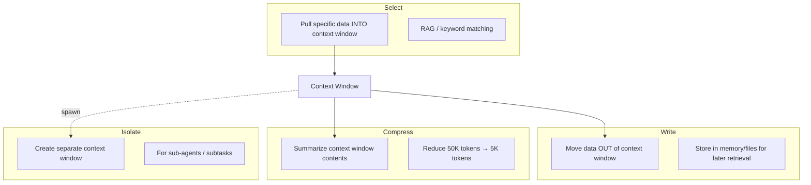
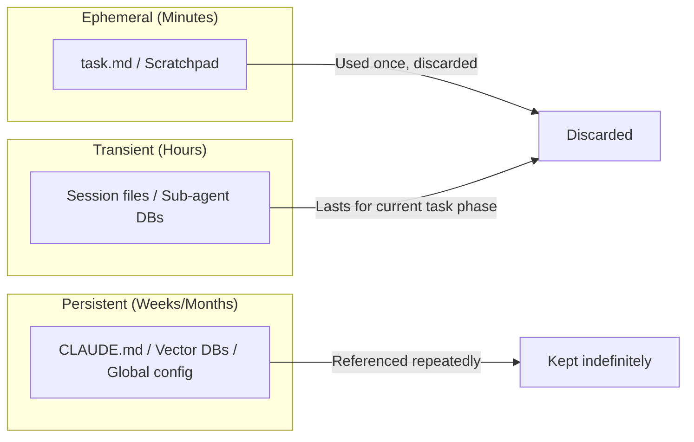
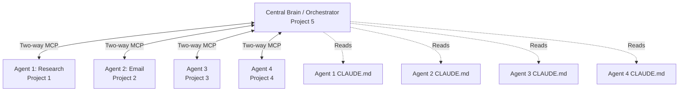
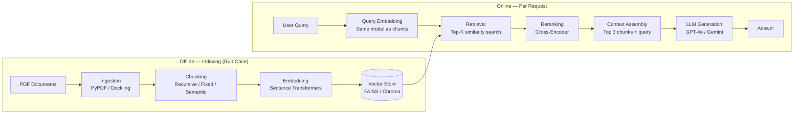
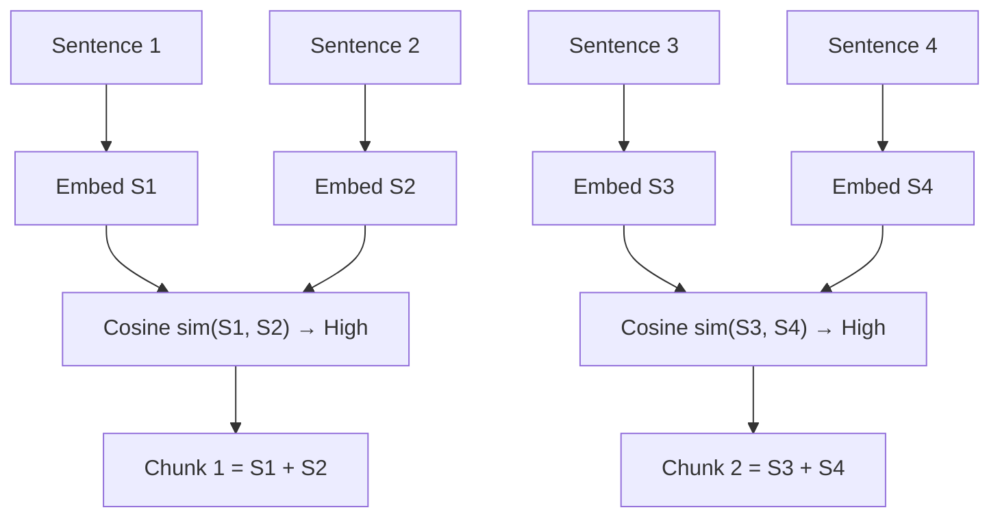
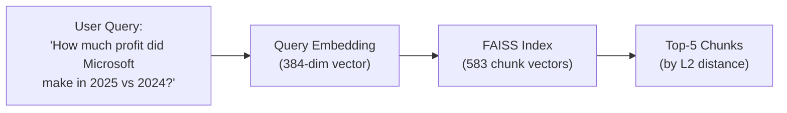
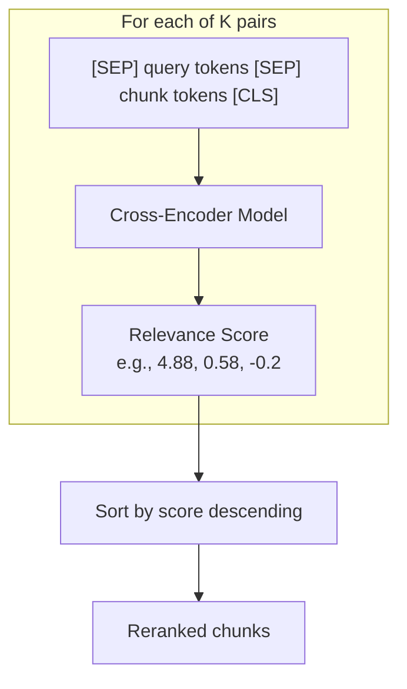

# Day 3: Retrieval-Augmented Generation (RAG) & the Write-Select-Compress-Isolate Framework

## Table of Contents

- [1. Overview](#1-overview)
- [2. Prerequisites](#2-prerequisites)
- [3. The Write-Select-Compress-Isolate (WSCI) Framework](#3-the-write-select-compress-isolate-wsci-framework)
  - [3.1 Write — Storing Context for Later Use](#31-write--storing-context-for-later-use)
  - [3.2 Select — Choosing What Enters the Context Window](#32-select--choosing-what-enters-the-context-window)
  - [3.3 Compress — Shrinking the Context Window](#33-compress--shrinking-the-context-window)
  - [3.4 Isolate — Separate Context for Sub-Agents](#34-isolate--separate-context-for-sub-agents)
- [4. Memory Lifetimes: Ephemeral, Transient, and Persistent](#4-memory-lifetimes-ephemeral-transient-and-persistent)
  - [4.1 Ephemeral (Scratchpad) Memory](#41-ephemeral-scratchpad-memory)
  - [4.2 Transient Memory](#42-transient-memory)
  - [4.3 Persistent (Enduring) Memory](#43-persistent-enduring-memory)
  - [4.4 Decision Heuristic: When to Store vs. Discard](#44-decision-heuristic-when-to-store-vs-discard)
- [5. Context Window Fundamentals](#5-context-window-fundamentals)
  - [5.1 Input + Output Budget](#51-input--output-budget)
  - [5.2 Context Rot and the 200K Sweet Spot](#52-context-rot-and-the-200k-sweet-spot)
  - [5.3 Token Budget Allocation for RAG](#53-token-budget-allocation-for-rag)
- [6. Multi-Agent Architecture: The Central Brain Pattern](#6-multi-agent-architecture-the-central-brain-pattern)
- [7. Retrieval-Augmented Generation (RAG) — Full Pipeline](#7-retrieval-augmented-generation-rag--full-pipeline)
  - [7.1 What RAG Is and Why It Exists](#71-what-rag-is-and-why-it-exists)
  - [7.2 RAG Pipeline Overview](#72-rag-pipeline-overview)
  - [7.3 Stage 1: Document Ingestion](#73-stage-1-document-ingestion)
  - [7.4 Stage 2: Chunking Strategies](#74-stage-2-chunking-strategies)
  - [7.5 Stage 3: Embedding — Converting Chunks to Vectors](#75-stage-3-embedding--converting-chunks-to-vectors)
  - [7.6 Stage 4: Vector Indexing and Storage](#76-stage-4-vector-indexing-and-storage)
  - [7.7 Stage 5: Query Embedding and Retrieval](#77-stage-5-query-embedding-and-retrieval)
  - [7.8 Stage 6: Reranking with Cross-Encoders](#78-stage-6-reranking-with-cross-encoders)
  - [7.9 Stage 7: Context Assembly and LLM Generation](#79-stage-7-context-assembly-and-llm-generation)
- [8. TF-IDF: Sparse Retrieval and Keyword Matching](#8-tf-idf-sparse-retrieval-and-keyword-matching)
  - [8.1 Inverse Document Frequency (IDF)](#81-inverse-document-frequency-idf)
  - [8.2 Term Frequency (TF)](#82-term-frequency-tf)
  - [8.3 TF-IDF Score](#83-tf-idf-score)
  - [8.4 Worked Example](#84-worked-example)
  - [8.5 Dense vs. Sparse Representations](#85-dense-vs-sparse-representations)
- [9. Hands-On Implementation: RAG Chatbot from Scratch](#9-hands-on-implementation-rag-chatbot-from-scratch)
  - [9.1 Environment Setup](#91-environment-setup)
  - [9.2 Document Upload and Ingestion](#92-document-upload-and-ingestion)
  - [9.3 Chunking with Recursive Character Text Splitter](#93-chunking-with-recursive-character-text-splitter)
  - [9.4 Embedding with Sentence Transformers](#94-embedding-with-sentence-transformers)
  - [9.5 Vector Indexing with FAISS](#95-vector-indexing-with-faiss)
  - [9.6 Embedding Visualization](#96-embedding-visualization)
  - [9.7 Retrieval](#97-retrieval)
  - [9.8 Reranking with Cross-Encoder](#98-reranking-with-cross-encoder)
  - [9.9 Context Assembly and LLM Generation](#99-context-assembly-and-llm-generation)
- [10. RAG Evaluation Metrics](#10-rag-evaluation-metrics)
- [11. Advanced RAG Concepts (Discussed Briefly)](#11-advanced-rag-concepts-discussed-briefly)
- [Implementation Notes](#implementation-notes)
- [Key Takeaways](#key-takeaways)
- [Glossary](#glossary)
- [Notation Reference](#notation-reference)
- [Connections to Other Topics](#connections-to-other-topics)
- [Open Questions / Areas for Further Study](#open-questions--areas-for-further-study)

---

## 1. Overview

This lecture covers two major pillars of context engineering: the **Write-Select-Compress-Isolate (WSCI) framework** for managing what enters and exits an LLM's context window, and a **complete hands-on implementation of a RAG chatbot from scratch** using Python in Google Colab. The lecture builds on Day 2's discussion of `CLAUDE.md` and system prompt structuring, focusing now on the "Write" and "Select" components of WSCI — where RAG is the core mechanism for *select*. The session includes a full coding walkthrough covering document ingestion, chunking, embedding, vector indexing with FAISS, retrieval, cross-encoder reranking, and LLM-based answer generation.

---

## 2. Prerequisites

- Understanding of context windows and how LLMs consume tokens (covered in Day 1–2)
- Familiarity with `CLAUDE.md` and `agents.md` file structures (Day 2)
- Basic Python and Google Colab usage
- Conceptual understanding of vectors, cosine similarity, and matrix operations
- An API key for OpenAI or Google Gemini
- A Hugging Face access token (for downloading sentence transformer models)

---

## 3. The Write-Select-Compress-Isolate (WSCI) Framework

The WSCI framework, originally defined by LangChain, governs how information flows in and out of the context window. All four operations are defined from the **perspective of the context window**.



**Walkthrough:** The context window is the central resource. *Write* moves information out of it into storage (files, databases) for future use. *Select* pulls information back in from storage — this is where RAG operates. *Compress* reduces the volume of the context window by summarizing its contents (analogous to `/compact` in Claude Code). *Isolate* creates a brand-new, separate context window for sub-agents so their tasks don't pollute the main task's context.

### 3.1 Write — Storing Context for Later Use

**Write** = move something **out** of the context window and store it somewhere (file, database, memory) so it can be retrieved later.

The stored information can take several forms:
- **Markdown files** (`.md`) — referenced by `CLAUDE.md` or `agents.md`
- **Vector databases** — for RAG retrieval
- **Task files** (`task.md`) — ephemeral scratchpads for current subtasks

### 3.2 Select — Choosing What Enters the Context Window

**Select** = dynamically choosing what information from storage should be part of the context window at a given moment. This is a **dynamic process** — the context contents change per query/API call.

RAG is the primary mechanism for *select*: retrieving relevant chunks from a database to augment the prompt.

### 3.3 Compress — Shrinking the Context Window

**Compress** = when the context window is ~80% full, summarize its contents to free space for upcoming tasks.

- Example: 50K tokens of accumulated context → 5K token summary
- In Claude Code: `/compact` performs compression; `/clear` wipes the context entirely
- Many coding agents perform **auto-compaction** when a threshold is reached
- Compression should be triggered proactively when output quality begins degrading

### 3.4 Isolate — Separate Context for Sub-Agents

**Isolate** = creating a completely separate context window for a sub-agent's API call, with **none** of the main task's tokens present.

**When to use isolation:**
- Analyzing results of past experiments without polluting the main task context
- Sub-agents performing specialized subtasks (e.g., code review, research)
- When the main context window is too full to accommodate a subtask

**How context is shared across sub-agents:**
- Files at the top of the hierarchy (`CLAUDE.md`, `agents.md`) are commonly accessible
- Sub-agents' `agents.md` files can reference shared files and databases
- Persistent memory can be made available across agents via file references
- Claude Code automatically adds relevant references when generating `agents.md` files

---

## 4. Memory Lifetimes: Ephemeral, Transient, and Persistent



**Walkthrough:** Memory is categorized by how long the information remains useful. Ephemeral memory (task.md scratchpads) is used for the current subtask and discarded. Transient memory persists across a session or task phase (e.g., morning and evening coding sessions on the same feature). Persistent memory (CLAUDE.md, vector databases, core documentation) is referenced throughout the life of a project.

### 4.1 Ephemeral (Scratchpad) Memory

- **Duration**: 2–5 minutes of implementation
- **Format**: `task.md` files — to-do lists, checklists, progress tracking
- **Purpose**: scratchpad for the current subtask (like a human using a notepad)
- **Example**: When building Phase 1A of a website, `task.md` tracks what's done and what's pending within that specific subtask
- **Lifecycle**: Created at subtask start, updated throughout, never used again after subtask completes

### 4.2 Transient Memory

- **Duration**: Hours (within a task phase, across sessions)
- **Format**: Markdown files, vector databases, structured documents
- **Purpose**: Information needed throughout a specific implementation phase but not permanently
- **Example**: Files referenced by a sub-agent's `agents.md` for the duration of a particular task; could involve RAG or TF-IDF keyword matching depending on complexity

### 4.3 Persistent (Enduring) Memory

- **Duration**: Weeks to months
- **Format**: `CLAUDE.md` files, global configuration, vector databases
- **Purpose**: Core project philosophy, always-needed references
- **Example**: The `ideas_v2.md` file referenced from `CLAUDE.md` throughout an entire project; email databases used repeatedly by an email reply agent

### 4.4 Decision Heuristic: When to Store vs. Discard

| Criterion | Action |
|-----------|--------|
| Used only once, right now | Don't store — just use it |
| Used in the next 2–5 minutes | `task.md` scratchpad (ephemeral) |
| Used across sessions within a phase | Session files or DB (transient) |
| Used throughout the entire project | `CLAUDE.md` references, vector DBs (persistent) |

---

## 5. Context Window Fundamentals

### 5.1 Input + Output Budget

The context window covers **both input and output tokens**. The LLM produces output auto-regressively (next-token prediction), and each generated token is appended to the existing token sequence. If the context window is completely filled with input, the output will be truncated.

> 💡 Common misconception: The context window is only for input. **The correct understanding is** it encompasses both input tokens and generated output tokens — you must leave room for the model's response.

### 5.2 Context Rot and the 200K Sweet Spot

Even though modern LLMs offer 1M–2M token context windows, the recommended working size is **100K–200K tokens**. Filling beyond this causes **context rot** — degradation in the quality of the model's outputs.

- 200K tokens appears repeatedly as the practical sweet spot across multiple implementations
- Filling 50–60% of a 1M token window (500K–600K tokens) can already cause context rot
- Claude Code warns when ~80–86% of the context window is filled

### 5.3 Token Budget Allocation for RAG

| Allocation | Percentage | Purpose |
|-----------|------------|---------|
| Retrieved context | ~60% | Chunks from RAG retrieval |
| System prompt + memory + knowledge | ~20% | Persistent instructions and background |
| Generation buffer | ~10% | Space for the LLM's response |
| Other (query, formatting) | ~10% | User query, separators, metadata |

> ⚠️ The instructor noted that a 10% generation buffer is likely too small — Claude Code itself warns at 80–86% context utilization.

---

## 6. Multi-Agent Architecture: The Central Brain Pattern

The instructor described a real-world architecture where multiple separate agents (not sub-agents — separate projects) are connected through a **central orchestrator agent** via **two-way MCP (Model Context Protocol)**.



**Walkthrough:**
- **5 separate projects**, each with its own agent, codebase, and `CLAUDE.md`
- The **Central Brain** (Project 5) is a pure orchestrator — it has **no execution tools**, only information-access and delegation tools
- Individual agents are specialized (research, email, etc.) but have no awareness of the overall company workflow
- The Central Brain provides **instructions** ("do this next"); individual agents provide **execution**
- `CLAUDE.md` files from each agent are referenced by the Central Brain to understand each agent's capabilities and philosophy
- Two-way MCP enables bidirectional communication between the orchestrator and each agent

**Why not connect agents directly to each other?** Individual agents lack the global context to know *when* and *what* to do — they only know *how*. The Central Brain holds the global picture and delegates accordingly.

---

## 7. Retrieval-Augmented Generation (RAG) — Full Pipeline

### 7.1 What RAG Is and Why It Exists

**Retrieval-Augmented Generation (RAG)** augments an LLM's prompt with information **retrieved from an external database**, enabling the model to answer questions about documents it was never trained on.

**Why RAG over alternatives:**

| Approach | Cost | Frequency | Knowledge Coverage |
|----------|------|-----------|-------------------|
| Pre-training from scratch | Extremely expensive | Once | Full corpus |
| Fine-tuning | Moderate | Occasionally | Domain-specific additions |
| **RAG** | **Low (per query)** | **Every request** | **Any indexed document** |

RAG is the most practical way to give an LLM access to information not in its training data — especially for documents that change over time.

### 7.2 RAG Pipeline Overview



**Walkthrough:**
1. **Offline (indexing)**: Documents are ingested, split into chunks, embedded as vectors, and stored in a vector database. This is done once (or periodically when documents change).
2. **Online (per request)**: The user's query is embedded using the **same embedding model**, the most similar chunks are retrieved via vector similarity search, optionally reranked with a cross-encoder, and the top chunks are concatenated with the query into a prompt for the LLM to generate an answer.

**Key architectural insight**: The separation of offline indexing from online retrieval is critical — embedding creation is the most time-consuming step and should not run on every user query.

### 7.3 Stage 1: Document Ingestion

Document ingestion converts raw documents (PDFs, web pages, text files) into a processable text format.

| Library | Speed | Quality | Best For |
|---------|-------|---------|----------|
| **PyPDF** | Very fast | Good for simple docs | Quick prototyping, simple PDFs |
| **Dockling** | 50–100x slower than PyPDF | Excellent for complex docs | Tables, images, mixed content |
| **DeepSeek OCR / Tesseract OCR** | Moderate | High for scanned docs | Industry-grade extraction |
| **Unstructured.io** | Moderate | Good | Multi-format documents |
| **Beautiful Soup** | Fast | Good for HTML | Web scraping |
| **Fire Crawl** | Reportedly fast | Reportedly good | Web crawling |
| **LlamaIndex Data Connectors** | Varies | Varies | Multi-source integration |

**Practical advice from the instructor:**
- For quick prototyping: start with **PyPDF** — it's fast and works well enough to validate downstream pipeline
- For production with complex documents: use **Dockling** or OCR-based techniques
- For industry-grade RAG: OCR-based extractors (DeepSeek OCR, Tesseract) are recommended

**Interesting research aside — DeepSeek OCR paper (Context Optical Compression):**
- When text is represented as images, you can compress to 10x fewer vision tokens while maintaining 97% OCR precision
- At 20x compression (only 5% of original tokens), accuracy still remains at ~60%
- This reveals a fundamental asymmetry: images require per-pixel representation while text captures the same concepts with far fewer tokens

### 7.4 Stage 2: Chunking Strategies

Chunking splits the ingested document into smaller pieces that can be individually embedded and retrieved.

| Strategy | Description | Pros | Cons | Best For |
|----------|-------------|------|------|----------|
| **Fixed-size** | Every chunk has the same character count (e.g., 200 chars) | Simple; works with any data format | Splits semantically related content | Large, unstructured corpora (e.g., internet data) |
| **Sentence-based** | Chunk boundaries align with sentence endings (periods) | Preserves sentence integrity | May produce very short/long chunks | Well-written prose documents |
| **Semantic** | Groups content by meaning using embedding similarity | Chunks are semantically coherent | Requires an embedding model; slower | Documents where meaning matters more than structure |
| **Sliding window** | Chunks overlap by a fixed number of characters | Preserves context continuity between chunks | Increases total chunk count | Use **in combination** with any other strategy |
| **Recursive** | Splits by hierarchy: sections → paragraphs → sentences → words, respecting max chunk size | Adapts to document structure; respects natural boundaries | Slightly more complex to configure | **Structured documents** (recommended for most use cases) |

#### Semantic Chunking — How It Works



**Walkthrough:** Each sentence is initially embedded separately. Pairs of adjacent sentences with high cosine similarity (their vectors point in nearly the same direction) are merged into a single chunk. This process repeats until maximum chunk size or maximum chunk count constraints are reached.

#### Sliding Window Overlap

- Overlap ensures **context continuity** between consecutive chunks
- The ending characters of chunk N appear as the starting characters of chunk N+1
- **Trade-off**: More overlap → better continuity but more total chunks (slower indexing, larger storage)
- **Extreme cases**: 0% overlap = no continuity; 100% overlap = infinite redundant chunks
- **Practical guideline**: 10–20% overlap is typical (e.g., 500-character chunks with 100-character overlap = 20%)

### 7.5 Stage 3: Embedding — Converting Chunks to Vectors

Embedding converts text chunks into dense numerical vectors in a high-dimensional space, enabling mathematical comparison of semantic similarity.

**Key distinction — Embedding models vs. generative models:**

| Property | Embedding Model (e.g., all-MiniLM-L6-v2) | Generative Model (e.g., GPT-4) |
|----------|-------------------------------------------|-------------------------------|
| Task | Encode text → fixed-length vector | Generate next token |
| Output | Vector (e.g., 384 dimensions) | Token sequence |
| Training | Masked language modeling (like BERT) | Next-token prediction |
| Architecture heritage | BERT-like (bidirectional) | GPT-like (autoregressive) |
| Purpose in RAG | Produce semantic representations of chunks | Generate final answers |

**Embedding model used in the lab**: `all-MiniLM-L6-v2`
- Parameters: ~22 million (much smaller than even small language models at ~1B)
- Output dimensionality: 384
- Architecture: 6-layer sentence transformer

**Other embedding options**: OpenAI `text-embedding-3-large`, Mistral embeddings, Hugging Face models, Cohere embed, BGE, E5

#### Embedding Dimensionality Trade-offs

| Dimensionality | Expressiveness | Search Speed | Best When |
|----------------|---------------|--------------|-----------|
| Low (e.g., 64) | Limited nuance capture | Fast | Document has high inherent diversity (e.g., quantum physics + cooking) |
| High (e.g., 768) | Rich nuance capture | Slower | Document has low diversity (e.g., single-topic recipe book) — need more dimensions to distinguish similar chunks |

**Key insight**: If the document's content is already diverse, even low-dimensional embeddings can separate chunks effectively because the inherent data diversity does the work. For homogeneous documents, higher dimensionality is needed to capture subtle distinctions.

**Critical rule**: The **same embedding model** must be used for both chunk embedding and query embedding. Different models produce vectors in different spaces — comparing them is meaningless ("apples to oranges").

### 7.6 Stage 4: Vector Indexing and Storage

Vector indexing makes similarity search efficient. Without indexing, finding the closest chunk to a query requires O(N) comparisons — one for each chunk.

**Three distinct concepts:**

| Concept | Role | Examples |
|---------|------|----------|
| **Embedding model** | Produces the vector | all-MiniLM-L6-v2, OpenAI text-embedding-3 |
| **Similarity metric** | Defines how to compare two vectors | Cosine similarity, dot product, L2 (Euclidean) distance |
| **Vector index** | Makes finding the best match efficient across thousands of vectors | FAISS, Chroma, Pinecone |

**Similarity Metrics:**

| Metric | Formula | Captures | Notes |
|--------|---------|----------|-------|
| Cosine similarity | $\cos(\theta) = \frac{A \cdot B}{\|A\| \|B\|}$ | Direction (angle) between vectors | Ignores magnitude; most common |
| Dot product | $A \cdot B = \sum_i a_i b_i$ | Direction + magnitude | Sensitive to vector norms |
| L2 (Euclidean) distance | $\|A - B\|_2 = \sqrt{\sum_i (a_i - b_i)^2}$ | Geometric distance in space | Used in FAISS `IndexFlatL2` |

**Vector Databases:**

| Database | Key Features | Trade-offs |
|----------|-------------|------------|
| **FAISS** (Facebook AI Similarity Search) | Extremely fast; uses IVF, ANN | Runs locally; best for speed |
| **Chroma** | Simple API; runs locally; built-in embedding | Fast but potentially less accurate for nuanced queries |
| **Pinecone** | Cloud-hosted; managed service | Requires API key; good for production |

**Real-world example from the instructor**: In a jewelry similarity search project (matching customer-provided jewelry images to inventory), FAISS dramatically outperformed vanilla similarity search — the difference was "day and night."

### 7.7 Stage 5: Query Embedding and Retrieval

1. The user's query is embedded using the **same model** as the chunks
2. The query vector is compared against all chunk vectors using the vector index
3. The **top-K** most similar chunks are returned (e.g., top 5)



**Walkthrough:** The user query is converted to the same 384-dimensional vector space using the same sentence transformer. FAISS then efficiently searches the index of 583 stored chunk vectors to find the 5 closest by L2 distance.

### 7.8 Stage 6: Reranking with Cross-Encoders

**Why reranking is needed**: The initial retrieval optimizes for **speed** (finding approximate matches fast), not for **precision**. The top-K results may not be in the best order of true relevance.

**How cross-encoder reranking works:**



**Walkthrough:**
1. For each retrieved chunk, create a pair: (query, chunk)
2. Concatenate with separator tokens into a single sequence: `[SEP] query [SEP] chunk [CLS]`
3. Pass through a cross-encoder model (a fine-tuned language model with a linear projection head)
4. The model outputs a single **relevance score** (not a vector — a scalar number)
5. Sort all pairs by score in descending order

**Why not use cross-encoder for initial retrieval?** Cross-encoders process each (query, chunk) pair through the full model — for 10,000 chunks, that's 10,000 forward passes. This is far too expensive. Instead: use fast bi-encoder retrieval for top-K, then expensive cross-encoder reranking on only K candidates.

**Model used**: `cross-encoder/ms-marco-MiniLM-L6-v2` — a cross-encoder fine-tuned on the MS MARCO passage ranking dataset.

**Observed result in the lab**:
- Before reranking: chunks from pages 9, 23, 87, 29, 29
- After reranking: reordered to 29, 87, 23, 29, 9
- The chunk from page 9 (stock price data, less relevant) dropped to last position
- The chunk from page 29 (actual revenue figures) moved to first position

### 7.9 Stage 7: Context Assembly and LLM Generation

The top reranked chunks (e.g., top 3) are concatenated and combined with the user query into a prompt for the LLM.

**System prompt template used in the lab:**
```
Answer the question using the context below.

Context: {concatenated top-3 chunks}

Question: {user query}

Provide a concise answer. If you don't find the info in the context, do not guess. Say that the info is not found in the document.
```

**Why the "do not guess" instruction is critical**: Without it, the LLM will fall back on its training data to produce an answer — this is **hallucination**. The whole point of RAG is to ground answers in the retrieved documents.

**Observed results**:
- Query about Microsoft's *profit*: Model correctly responded "the context provides revenue figures, not profit figures. Therefore the information on how much profit Microsoft made is not found in the document."
- Query about revenue increase 2024→2025: Model correctly extracted "$36 billion" from the retrieved chunks.

---

## 8. TF-IDF: Sparse Retrieval and Keyword Matching

### 8.1 Inverse Document Frequency (IDF)

**IDF** measures how **rare** a word is across all documents/chunks. Rare words are more valuable for distinguishing relevant chunks.

$$\text{IDF}(t) = \log\left(\frac{N}{n_t}\right)$$

| Symbol | Meaning | Range |
|--------|---------|-------|
| $t$ | A term (word) from the query | — |
| $N$ | Total number of documents (chunks) | Positive integer |
| $n_t$ | Number of documents containing term $t$ | 1 to $N$ |

**Plain English**: IDF is the logarithm of (total documents / documents containing this word). A word that appears in every document gets a low IDF (not useful for discrimination). A word that appears in only one document gets a high IDF (extremely useful for finding that specific chunk).

### 8.2 Term Frequency (TF)

**TF** measures how often a term appears **within a specific document/chunk**.

$$\text{TF}(t, d) = \text{count of term } t \text{ in document } d$$

**Why TF complements IDF**: IDF alone would ignore common-but-relevant words. If a user asks about "cats" and one chunk mentions "cat" 50 times while most chunks mention it once, TF captures that the 50-mention chunk is likely the most relevant, even though "cat" has a low IDF.

### 8.3 TF-IDF Score

$$\text{TF-IDF}(t, d) = \text{TF}(t, d) \times \text{IDF}(t)$$

The final document relevance score is the **sum of TF-IDF scores across all query terms**:

$$\text{Score}(q, d) = \sum_{t \in q} \text{TF}(t, d) \times \text{IDF}(t)$$

### 8.4 Worked Example

**Documents**: D1 = "cats drink milk", D2 = "dogs drink water", D3 = "cats eat fish"
**Query**: "cats drink"
**N = 3**

| Term | IDF Calculation | IDF Value |
|------|----------------|-----------|
| cats | log(3/2) — appears in D1, D3 | 0.405 |
| drink | log(3/2) — appears in D1, D2 | 0.405 |

| Document | TF(cats) | TF(drink) | TF-IDF(cats) | TF-IDF(drink) | **Total Score** |
|----------|----------|-----------|-------------|--------------|----------------|
| D1 | 1 | 1 | 0.405 | 0.405 | **0.81** |
| D2 | 0 | 1 | 0 | 0.405 | **0.405** |
| D3 | 1 | 0 | 0.405 | 0 | **0.405** |

**Result**: D1 ranks first (0.81) — correctly matching the query "cats drink" which is most similar to "cats drink milk."

**Intuitive example — "quantum" vs. "cat" in a children's story book:**
- "quantum" → extremely high IDF (rare in a kids' book) → easy to find the one chunk that mentions it
- "cat" → low IDF (appears everywhere) → BUT one chunk mentions "cat" 50 times → high TF compensates for low IDF
- TF-IDF balances **rarity** (IDF) with **local frequency** (TF)

### 8.5 Dense vs. Sparse Representations

| Property | Dense (Sentence Transformers) | Sparse (TF-IDF / BM25) |
|----------|------------------------------|------------------------|
| Vector type | Most dimensions have non-zero values | Most dimensions are zero |
| Dimensionality | Fixed by model (e.g., 384) | Size of vocabulary (e.g., 10,000) |
| What each dimension represents | Learned semantic feature | One specific word |
| Captures | Semantic meaning | Keyword overlap |
| Strengths | "memory architectures" ↔ "how agents remember" | Exact keyword matching ("ChromaDB" → finds ChromaDB docs) |
| Weaknesses | May miss exact keyword matches | Misses semantic similarity |

**Hybrid search** combines both: dense retrieval for semantic understanding + sparse retrieval for keyword precision. Some RAG systems use both approaches simultaneously.

---

## 9. Hands-On Implementation: RAG Chatbot from Scratch

### 9.1 Environment Setup

```python
# Installation
!pip install sentence-transformers faiss-cpu langchain pypdf langchain-community langchain-text-splitters
```

### 9.2 Document Upload and Ingestion

```python
from google.colab import files
uploaded = files.upload()                      # Interactive file upload widget

for file_name in uploaded.keys():
    print("Uploaded:", file_name)

from langchain_community.document_loaders import PyPDFLoader

pdf_file = list(uploaded.keys())[0]            # First uploaded file
loader = PyPDFLoader(pdf_file)                 # PyPDF ingestion
documents = loader.load()                      # Load all pages
print("Number of pages loaded:", len(documents))  # 98 pages for Microsoft report
```

The `documents` variable is a list where each element represents one page. `documents[0]` contains the text content of page 1, `documents[3]` contains page 4, etc.

### 9.3 Chunking with Recursive Character Text Splitter

```python
from langchain_text_splitters import RecursiveCharacterTextSplitter

text_splitter = RecursiveCharacterTextSplitter(
    chunk_size=500,        # Max 500 characters per chunk
    chunk_overlap=100      # 100 characters shared between adjacent chunks (20% overlap)
)
chunks = text_splitter.split_documents(documents)
print("Total chunks created:", len(chunks))    # 583 chunks
```

**Verification**: The last ~100 characters of `chunks[0].page_content` appear as the first ~100 characters of `chunks[1].page_content` — confirming the sliding window overlap is working.

### 9.4 Embedding with Sentence Transformers

```python
import faiss
import numpy as np
from sentence_transformers import SentenceTransformer

model = SentenceTransformer("all-MiniLM-L6-v2")  # 22M parameter embedding model

# Embed all chunks
embeddings = model.encode([chunk.page_content for chunk in chunks])
# embeddings.shape → (583, 384) — 583 chunks × 384 dimensions
```

> ⚠️ You may need a Hugging Face token to download the model. Store it in Google Colab's Secrets (key icon in the sidebar).

### 9.5 Vector Indexing with FAISS

```python
dimension = embeddings.shape[1]                # 384
index = faiss.IndexFlatL2(dimension)           # L2 distance index
index.add(np.array(embeddings))                # Add all chunk vectors
print("Total vectors in index:", index.ntotal) # 583
```

### 9.6 Embedding Visualization

```python
import matplotlib.pyplot as plt

def visualize_embedding(vector, chunk_text=None, max_text_chars=500):
    vector = np.array(vector)
    normalized = (vector - vector.min()) / (vector.max() - vector.min())
    color_band = normalized.reshape(1, -1)

    if chunk_text is not None:
        print("Chunk text:")
        print(chunk_text[:max_text_chars])
        print()

    plt.figure(figsize=(12, 2))
    plt.imshow(color_band, aspect='auto', cmap='viridis')
    plt.yticks([])
    plt.xlabel(f"Embedding Dimensions ({len(vector)})")
    plt.title("Vector Representation")
    plt.show()

# Visualize a chunk's embedding
visualize_embedding(embeddings[1], chunks[1].page_content)
```

Each color in the band corresponds to one of the 384 dimensions — the full color strip is how the sentence transformer "sees" that chunk as pure numbers.

### 9.7 Retrieval

```python
query = input("Enter your question: ")
query_embedding = model.encode(query)          # Same model as chunks

# Retrieve top-5 similar chunks
D, I = index.search(np.array([query_embedding]), k=5)
retrieved_chunks = [chunks[i] for i in I[0]]

# Display retrieved chunks with page numbers
print("Top retrieved chunks:\n")
for chunk in retrieved_chunks:
    print(chunk.page_content)
    print(f"Page: {chunk.metadata['page']}")
    print("***")
```

### 9.8 Reranking with Cross-Encoder

```python
from sentence_transformers import CrossEncoder

reranker = CrossEncoder("cross-encoder/ms-marco-MiniLM-L6-v2")

# Create (query, chunk) pairs
pairs = [(query, chunk.page_content) for chunk in retrieved_chunks]

# Get relevance scores
scores = reranker.predict(pairs)

# Sort by descending score
ranked_chunks = sorted(zip(scores, retrieved_chunks), reverse=True)

# Display reranked results
print("After reranking:")
for score, chunk in ranked_chunks:
    print(f"Score: {score}")
    print(chunk.page_content)
    print(f"Page: {chunk.metadata['page']}")
    print("...")
```

### 9.9 Context Assembly and LLM Generation

```python
# Take top 3 reranked chunks
top_chunks = [chunk.page_content for _, chunk in ranked_chunks[:3]]
context = "\n\n".join(top_chunks)

# Build prompt
prompt = f"""Answer the question using the context below.

Context: {context}

Question: {query}

Provide a concise answer. If you don't find the info in the context, do not guess. Say that the info is not found in the document."""

# Generate answer (OpenAI example)
import openai
from google.colab import userdata

client = openai.OpenAI(api_key=userdata.get("OPENAI_KEY"))
response = client.chat.completions.create(
    model="gpt-4o-mini",
    messages=[{"role": "user", "content": prompt}]
)
answer = response.choices[0].message.content
print("Answer:\n", answer)
```

---

## 10. RAG Evaluation Metrics

| Metric | Definition | Interpretation |
|--------|-----------|----------------|
| **Context Precision** | Of the retrieved chunks, what fraction is actually relevant? | Low precision → too much junk in retrieval (reduce K) |
| **Context Recall** | Of all relevant chunks in the database, what fraction was retrieved? | Low recall → missing important information (increase K) |
| **Faithfulness** | Does the generated answer stick to the retrieved context? | Low faithfulness → hallucination |
| **Answer Relevance** | Does the answer address the user's question? | Low relevance → poor prompt or poor retrieval |

**Diagnostic example from the quiz:**
- Context recall = 95%, Context precision = 40%
- **Interpretation**: The system retrieves almost everything relevant (good recall) but also retrieves a lot of irrelevant chunks (poor precision). **Solution**: Reduce K or improve the embedding model.

---

## 11. Advanced RAG Concepts (Discussed Briefly)

| Concept | Description | Status in Lecture |
|---------|-------------|-------------------|
| **Multi-query retrieval** | Rephrase the same query 3 ways → retrieve for each → union of results. Increases probability of finding semantically matching chunks. | Discussed in quiz |
| **Just-in-time retrieval** (Anthropic) | Load only metadata initially; retrieve full content only when the context determines it's needed. | Mentioned briefly |
| **Reciprocal Rank Fusion** | Merges results from dense + sparse search into a unified ranking. | Mentioned, skipped |
| **RAG for tool selection** | Embed tool descriptions in vector DB; retrieve relevant tools per query instead of loading all 50+ tool descriptions into the prompt. LangChain reports 3x accuracy improvement. | Discussed in quiz |
| **Hybrid search** | Combine dense (semantic) + sparse (keyword) retrieval for best of both worlds. | Discussed conceptually |

---

## Implementation Notes

**Frameworks**: LangChain, LlamaIndex — both are pipeline frameworks that stitch together ingestion, chunking, embedding, indexing, and retrieval components. The instructor has no strong preference between them.

**GPU considerations**: The lab runs entirely on CPU (Google Colab free tier). FAISS CPU is used (`faiss-cpu`). For production with large document collections, GPU-accelerated FAISS would significantly speed up indexing and retrieval.

**Numerical stability**: The sentence transformer embeddings are normalized before visualization (min-max normalization to [0, 1] range).

**API usage**: The lab demonstrated switching from OpenAI (billing issue) to Gemini mid-session — the LLM choice for the generation step is interchangeable; only the embedding model must remain consistent between indexing and query time.

**Practical finding from the instructor**: In their email reply agent, a **well-crafted 600–1000 line markdown file** outperformed a RAG vector database in both latency and accuracy. "The simpler the better" — RAG is not always necessary if the knowledge base is small enough to fit in a structured document. They also built a **voice agent** with a US phone number where callers could ask about company programs — using only a properly written markdown file as the knowledge base, output quality was excellent and latency was negligible.

**Indexing frequency**: The instructor plans to re-index their email database once every 1–2 months (accumulating ~2,000 new email threads per month on top of an existing ~10,000). Per-request retrieval, by contrast, happens 100–200 times per day.

**Suggested take-home exercises** from the instructor:
1. Replace the document ingestion pipeline (try PyPDF, Dockling, or LlamaIndex data connectors)
2. Change the chunking strategy (try semantic or sentence-based)
3. Swap the vector database (try ChromaDB instead of FAISS)
4. Use an open-source LLM for generation (instead of OpenAI/Gemini)
5. Deploy the RAG chatbot as a web application with a frontend

---

## Key Takeaways

- **WSCI Framework**: Write (store for later), Select (pull into context = RAG), Compress (summarize to free space), Isolate (separate context for sub-agents)
- **Memory has three lifetimes**: ephemeral (`task.md`, minutes), transient (session files, hours), persistent (`CLAUDE.md`, weeks/months). If something is used only once, don't store it at all.
- **Context rot is real**: Even with 1M+ token windows, keep working context to **100–200K tokens** for best quality.
- **The RAG pipeline has two phases**: offline indexing (ingest → chunk → embed → store) runs once; online retrieval (query embed → retrieve → rerank → generate) runs per request.
- **Chunking matters**: Recursive chunking respects document hierarchy and is preferred for structured documents. Overlap of 10–20% preserves context continuity between chunks.
- **Same embedding model for chunks and queries** — different models = different vector spaces = meaningless comparisons.
- **Two-stage retrieval**: Fast bi-encoder retrieval (top-K) → slow but accurate cross-encoder reranking (on K candidates only). Using cross-encoder on all chunks directly is prohibitively expensive.
- **TF-IDF provides sparse/keyword retrieval** complementary to dense/semantic retrieval — IDF captures word rarity, TF captures local word frequency, and their product balances both.
- **Ground the LLM**: Always instruct the model to answer only from retrieved context and to say "not found" otherwise — this prevents hallucination.
- **RAG is not always the answer**: For small knowledge bases, a well-written markdown document can outperform a full RAG pipeline in both speed and accuracy.

---

## Glossary

| Term | Definition | First Introduced |
|------|-----------|------------------|
| RAG | Retrieval-Augmented Generation — augmenting LLM prompts with retrieved documents from a database | Section 7.1 |
| WSCI | Write-Select-Compress-Isolate — framework for managing context window contents | Section 3 |
| Chunking | Splitting a document into smaller pieces for individual embedding and retrieval | Section 7.4 |
| Embedding | Converting text into a dense numerical vector in a high-dimensional space | Section 7.5 |
| Vector index | Data structure that enables efficient similarity search across many vectors | Section 7.6 |
| FAISS | Facebook AI Similarity Search — high-performance vector similarity search library | Section 7.6 |
| Cross-encoder | Model that takes a (query, document) pair and produces a single relevance score | Section 7.8 |
| Bi-encoder | Model that independently encodes query and document into separate vectors for comparison | Section 7.5 |
| TF-IDF | Term Frequency × Inverse Document Frequency — sparse retrieval scoring method | Section 8 |
| Context rot | Degradation of LLM output quality when too much context is provided | Section 5.2 |
| Sparse vector | Vector where most dimensions are zero (each dimension = one word from vocabulary) | Section 8.5 |
| Dense vector | Vector where most dimensions have non-zero values (each dimension = learned feature) | Section 8.5 |
| Reranking | Re-ordering retrieved results by a more accurate (but slower) scoring model | Section 7.8 |
| MCP | Model Context Protocol — enables bidirectional communication between AI agents | Section 6 |
| Sliding window | Chunking technique where consecutive chunks overlap by a fixed number of characters | Section 7.4 |
| Auto-compaction | Automatic context compression triggered when a usage threshold is reached | Section 3.3 |
| Transient memory | Information stored for the duration of a task phase (hours, not minutes or months) | Section 4.2 |
| Semantic chunking | Grouping text by meaning (embedding similarity) rather than by structural boundaries | Section 7.4 |

---

## Notation Reference

| Symbol | Meaning |
|--------|---------|
| $K$ | Number of top results to retrieve (top-K) |
| $N$ | Total number of documents/chunks |
| $n_t$ | Number of documents containing term $t$ |
| $\text{TF}(t, d)$ | Frequency of term $t$ in document $d$ |
| $\text{IDF}(t)$ | Inverse document frequency of term $t$: $\log(N/n_t)$ |
| $\cos(\theta)$ | Cosine similarity between two vectors |
| $\|A - B\|_2$ | L2 (Euclidean) distance between vectors A and B |
| $d_k$ | Dimensionality of embedding space |

---

## Connections to Other Topics

- **Day 2 → Day 3**: `CLAUDE.md` structuring and system prompts (Day 2) are the persistent context layer; RAG (Day 3) is the dynamic context selection mechanism that complements static file references
- **Day 3 → Day 4 (tomorrow)**: The *Isolate* component of WSCI connects directly to MCP and agent tool use — tomorrow's topic. The Central Brain multi-agent pattern relies on MCP for inter-agent communication
- **RAG ↔ Context Engineering**: RAG is the primary mechanism for the "Select" operation in WSCI. Context engineering is the broader discipline of designing what enters the context window; RAG is the most important tool within that discipline
- **Embedding models ↔ NLP**: Sentence transformers descend from BERT (masked language modeling), not GPT (next-token prediction). Understanding this lineage explains why they excel at encoding rather than generating
- **TF-IDF ↔ Traditional NLP**: TF-IDF predates neural approaches; it's a statistical method that remains valuable for keyword-heavy queries and as the sparse component in hybrid search

---

## Open Questions / Areas for Further Study

- **Optimal chunk size and overlap**: The lecture used 500 characters / 100 overlap. How to empirically determine the best values for a given corpus? What evaluation framework to use?
- **DeepSeek OCR / Context Optical Compression**: The research showing 97% OCR precision at 10x vision token compression has implications for multimodal RAG — how to leverage this for document understanding pipelines?
- **Hybrid search implementation**: Dense + sparse retrieval with reciprocal rank fusion — the lecture mentioned this but did not implement it. How much does hybrid search improve over pure dense retrieval?
- **Agentic RAG**: Having an agent decide *when* and *what* to retrieve, rather than retrieving on every query — how to implement this with the WSCI framework?
- **RAG evaluation at scale**: Beyond precision/recall, how to systematically evaluate RAG pipelines using frameworks like RAGAS or TruLens?
- **When RAG loses to simpler approaches**: The instructor's experience with a well-crafted markdown file outperforming RAG — what are the breakpoints where RAG becomes necessary vs. overkill?
- **Graph RAG and knowledge graph integration**: Not discussed in this lecture — how do knowledge graphs complement or replace vector-based RAG for structured domains?
