# Day 4: Tools, Function Calling & Model Context Protocol (MCP) — Connecting LLMs to the Real World

## Table of Contents

- [1. Overview](#1-overview)
- [2. Prerequisites](#2-prerequisites)
- [3. Why LLMs Need Tools](#3-why-llms-need-tools)
  - [3.1 The Three Fundamental Limitations of LLMs](#31-the-three-fundamental-limitations-of-llms)
  - [3.2 Tools as the Solution](#32-tools-as-the-solution)
  - [3.3 Tool Results and Context Window Impact](#33-tool-results-and-context-window-impact)
  - [3.4 RAG vs. Tool Results — What's the Difference?](#34-rag-vs-tool-results--whats-the-difference)
- [4. Tool Schemas — Describing Tools to the LLM](#4-tool-schemas--describing-tools-to-the-llm)
  - [4.1 Anatomy of a Tool Schema](#41-anatomy-of-a-tool-schema)
  - [4.2 Tool Schema Design Principles](#42-tool-schema-design-principles)
  - [4.3 Vague vs. Well-Defined Schema — Comparison](#43-vague-vs-well-defined-schema--comparison)
- [5. The Tool Life Cycle Pipeline](#5-the-tool-life-cycle-pipeline)
  - [5.1 Five Steps of Tool Interaction](#51-five-steps-of-tool-interaction)
  - [5.2 Who Runs the Tool?](#52-who-runs-the-tool)
- [6. Scaling Tool Descriptions — RAG for Tool Selection](#6-scaling-tool-descriptions--rag-for-tool-selection)
  - [6.1 The Problem: Too Many Tools](#61-the-problem-too-many-tools)
  - [6.2 Grouped Tool Descriptions](#62-grouped-tool-descriptions)
- [7. Model Context Protocol (MCP)](#7-model-context-protocol-mcp)
  - [7.1 The N × M Problem — Why MCP Exists](#71-the-n--m-problem--why-mcp-exists)
  - [7.2 The USB-C Analogy](#72-the-usb-c-analogy)
  - [7.3 MCP Client vs. MCP Server — Roles Defined](#73-mcp-client-vs-mcp-server--roles-defined)
  - [7.4 The Three MCP Primitives](#74-the-three-mcp-primitives)
  - [7.5 Transport Layer: stdio vs. HTTP/SSE](#75-transport-layer-stdio-vs-httpsse)
  - [7.6 The Client-Server Handshake](#76-the-client-server-handshake)
  - [7.7 Tool Call Flow in MCP](#77-tool-call-flow-in-mcp)
  - [7.8 MCP Data Flow — Complete Walkthrough](#78-mcp-data-flow--complete-walkthrough)
  - [7.9 Who Controls the LLM's Context?](#79-who-controls-the-llms-context)
  - [7.10 MCP Server Design — Principles and Anti-Patterns](#710-mcp-server-design--principles-and-anti-patterns)
  - [7.11 MCP Server Safety and Guardrails](#711-mcp-server-safety-and-guardrails)
  - [7.12 Key Conceptual Clarifications (Quiz)](#712-key-conceptual-clarifications-quiz)
- [8. Just-In-Time (JIT) Instructions](#8-just-in-time-jit-instructions)
  - [8.1 The Problem JIT Solves](#81-the-problem-jit-solves)
  - [8.2 JIT in Tool Results (Server → Client)](#82-jit-in-tool-results-server--client)
  - [8.3 JIT in Tool Calls (Client → Server)](#83-jit-in-tool-calls-client--server)
  - [8.4 JIT Concrete Example — Fuel Estimation](#84-jit-concrete-example--fuel-estimation)
  - [8.5 When JIT Is Needed vs. Not](#85-when-jit-is-needed-vs-not)
- [9. The ReAct Pattern — Reasoning + Acting](#9-the-react-pattern--reasoning--acting)
  - [9.1 The ReAct Loop Explained](#91-the-react-loop-explained)
  - [9.2 Single-Step ReAct Example](#92-single-step-react-example)
  - [9.3 Multi-Step ReAct Example](#93-multi-step-react-example)
  - [9.4 ReAct with Error Handling](#94-react-with-error-handling)
  - [9.5 Why the Thought Step Matters](#95-why-the-thought-step-matters)
  - [9.6 Token Consumption Trade-Off](#96-token-consumption-trade-off)
- [10. Multi-Agent Architecture: The Central Brain Pattern](#10-multi-agent-architecture-the-central-brain-pattern)
  - [10.1 The Problem — Isolated Agents](#101-the-problem--isolated-agents)
  - [10.2 Architecture — Central Brain as Orchestrator](#102-architecture--central-brain-as-orchestrator)
  - [10.3 Why Not Connect Agents Directly?](#103-why-not-connect-agents-directly)
  - [10.4 Role Separation: Instructions vs. Execution](#104-role-separation-instructions-vs-execution)
  - [10.5 Shared Context Across Agents](#105-shared-context-across-agents)
  - [10.6 Central Brain and MCP — The Connection](#106-central-brain-and-mcp--the-connection)
- [Implementation Notes](#implementation-notes)
- [Key Takeaways](#key-takeaways)
- [Glossary](#glossary)
- [Notation Reference](#notation-reference)
- [Connections to Other Topics](#connections-to-other-topics)
- [Open Questions / Areas for Further Study](#open-questions--areas-for-further-study)

---

## 1. Overview

This lecture covers the **tool use** and **Model Context Protocol (MCP)** pillars of context engineering — how LLMs interact with external functions, APIs, and software to access live data, perform computation, and take real-world actions. The session establishes why LLMs need tools (they cannot access live data, perform reliable computation, or effect real-world changes on their own), introduces the formal structure of **tool schemas**, and provides a comprehensive walkthrough of the **MCP architecture** including the client-server model, three primitives (tools, resources, prompts), transport layers, and the handshake protocol. The lecture also covers **Just-In-Time (JIT) instructions** for context-efficient tool use, the **ReAct (Reasoning + Acting) pattern** for multi-step agent loops with explicit thought steps, and the **Central Brain pattern** — a multi-agent orchestration architecture using two-way MCP to coordinate specialized agents.

---

## 2. Prerequisites

- Understanding of context windows, context rot, and the six core elements (Day 1)
- Familiarity with `CLAUDE.md`, system prompts, and RAG (Days 2–3)
- Understanding of the WSCI framework — Write, Select, Compress, Isolate (Day 3)
- Basic understanding of APIs and JSON format
- Familiarity with client-server architecture concepts
- Python basics (for understanding server code examples)

---

## 3. Why LLMs Need Tools

### 3.1 The Three Fundamental Limitations of LLMs

LLMs are **next-token prediction models**. Despite their emergent capabilities, they have three fundamental limitations that tools address:

| Limitation | Description | Example |
|-----------|-------------|---------|
| **No access to live data** | LLMs have no connection to the internet or real-time databases | Cannot fetch current weather, stock prices, or exchange rates |
| **Unreliable computation** | LLMs are not deterministic calculation engines; they can hallucinate mathematical results | `7321 × 8761` may produce errors — a calculator tool gives a deterministic answer |
| **No real-world effects** | LLMs cannot independently take actions in external systems | Cannot send an email, place an Amazon order, post to Slack, or create a 3D model |

> **Key insight:** LLMs do not *execute* tools. LLMs *decide* which tool to call and *produce a structured response* specifying the tool name and arguments. The actual execution is performed by the tool's own logic.

### 3.2 Tools as the Solution

Tools bridge the gap between what an LLM can reason about and what it can accomplish:

- **Live data access**: Weather APIs, financial data APIs, database queries
- **Computation**: Calculator tools, code execution environments
- **Real-world actions**: Email sending (Gmail API), messaging (Slack MCP), 3D modeling (Blender MCP), file system operations

### 3.3 Tool Results and Context Window Impact

When an LLM makes a tool call, the result is stored back in the context window. This means:

1. Tool results consume tokens from the context budget
2. Large tool responses (e.g., a 5,000-token JSON from Slack) can bloat the context
3. Tool descriptions themselves consume tokens — concise schemas are essential
4. The context must reserve space for tool results alongside RAG results, system prompts, and conversation history

> **Key insight:** Tool results add to the context window — you must budget for them. If a tool returns a massive JSON response, not all of it needs to enter the LLM's context. The MCP client is responsible for deciding what subset of tool results to pass to the LLM.

### 3.4 RAG vs. Tool Results — What's the Difference?

A student asked how RAG results differ from tool results. The distinction is fundamental:

| Aspect | RAG Results | Tool Results (via MCP) |
|--------|------------|----------------------|
| **Data source** | Pre-indexed documents stored as vector embeddings | Live data from APIs, databases, or external services |
| **Update frequency** | Static or infrequently updated (e.g., a 2025 shareholder report) | Real-time or near-real-time (e.g., current stock price, live weather) |
| **Mechanism** | Query → embed → cosine similarity → retrieve top-K chunks | Structured tool call → function execution → JSON response |
| **LLM agnostic?** | Depends on implementation | MCP is inherently LLM-agnostic by protocol design |

> **Key insight:** RAG retrieves from a *static knowledge base* (documents converted to embeddings). MCP tools access *live, dynamic data* that changes in real time. Both contribute context to the LLM, but they serve fundamentally different purposes.

---

## 4. Tool Schemas — Describing Tools to the LLM

### 4.1 Anatomy of a Tool Schema

A tool schema is a JSON description that tells the LLM what a tool does, what inputs it expects, and what outputs it returns. The schema is what enables the LLM to decide *which* tool to call and *how* to call it.

```json
{
  "name": "search_products",
  "description": "Search the product catalog from the e-commerce database. Returns top 50 matching items with price, availability, and category.",
  "parameters": {
    "type": "object",
    "properties": {
      "query": {
        "type": "string",
        "description": "Search keyword to match against product name, description, or SKU"
      },
      "category": {
        "type": "string",
        "enum": ["electronics", "clothing", "home", "sports", "books"],
        "description": "Product category to filter results"
      },
      "max_results": {
        "type": "integer",
        "description": "Maximum number of results to return (default: 50)"
      }
    },
    "required": ["query"]
  }
}
```

### 4.2 Tool Schema Design Principles

| Principle | Description | Example |
|-----------|-------------|---------|
| **Verb-noun naming** | Tool name should follow `action_entity` format in snake_case | `search_missions`, `get_weather_forecast`, `calculate_fuel_estimate` |
| **Clear description** | Explain what the tool does, what it returns, and when to use it | "Search the AstroLog mission database by keywords, status, etc. Returns matching missions with status, crew, and destination. Use when the user asks about mission launches or destinations." |
| **Enumerate constraints** | Use `enum` for categorical parameters instead of free-text strings | `"enum": ["planned", "in_transit", "completed", "delayed", "aborted"]` — prevents LLM from hallucinating invalid values |
| **Required vs. optional** | Only mark truly required parameters as required; allow defaults for optional ones | Marking everything as required forces the LLM to hallucinate values for fields it doesn't know |
| **Return descriptions** | Document what the tool returns so the LLM knows how to interpret results | `"returns": { "missions": [{ "id": "string", "name": "string", "status": "string" }] }` |
| **Low parameter count** | Keep parameters under 5; combine related fields into objects | More parameters = more chances for the LLM to make errors |

### 4.3 Vague vs. Well-Defined Schema — Comparison

| Aspect | Vague Schema | Well-Defined Schema |
|--------|-------------|-------------------|
| **Name** | `getMissionData` (camelCase, ambiguous) | `search_missions` (snake_case, verb-noun) |
| **Description** | "Gets mission data" (lazy, uninformative) | "Search the AstroLog mission database by keywords, status, etc. Returns matching missions with status, crew, and destination." |
| **Parameters** | `"q": { "type": "string" }` (cryptic name, no description) | `"query": { "type": "string", "description": "Search keyword to match against mission name, destination, or crew names" }` |
| **Constraints** | `"status": { "type": "string" }` (no enum) | `"status": { "type": "string", "enum": ["planned", "in_transit", "completed", "delayed", "aborted"] }` |
| **Token cost** | ~1/3 of well-defined (fewer tokens but far less useful) | ~3× the vague schema but dramatically more useful to the LLM |

> **Key insight:** A well-defined schema costs more tokens but prevents hallucination, reduces errors, and enables the LLM to make correct tool calls on the first attempt. This is a worthwhile trade-off.

---

## 5. The Tool Life Cycle Pipeline

### 5.1 Five Steps of Tool Interaction

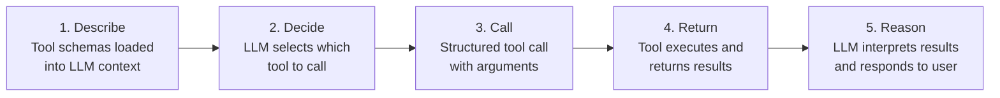

**Walkthrough:** (1) Tool schemas — names, descriptions, parameter definitions — are loaded into the LLM's context. (2) The LLM reads the user query and available schemas, then decides which tool(s) to call. (3) The LLM produces a *structured output* specifying the tool name and arguments (this is not shown to the user). (4) The tool executes and returns its result. (5) The LLM reasons over the tool result and produces a natural-language response for the user.

> **Key insight:** The tool schema most heavily impacts **Step 2 (Decide)**. A poor schema causes the LLM to pick the wrong tool or pass incorrect arguments — the rest of the pipeline inherits that error.

### 5.2 Who Runs the Tool?

This is a critical distinction:

- **The LLM does NOT execute tools.** The LLM produces a structured JSON describing which tool to call and what arguments to pass.
- **The tool's own logic executes the function.** The structured output from the LLM is used to invoke the function programmatically.
- The LLM produces **two types of output** during a tool interaction:
  1. **Structured tool call** (hidden from user) — specifies tool name + arguments
  2. **Natural language response** (shown to user) — the final answer after reasoning over tool results

---

## 6. Scaling Tool Descriptions — RAG for Tool Selection

### 6.1 The Problem: Too Many Tools

Each tool description consumes approximately **100–200 tokens**. With scaling:

| Number of Tools | Token Consumption | Impact |
|----------------|-------------------|--------|
| 5–10 | 500–2,000 tokens | Acceptable — include all in system prompt |
| 50–100 | 5,000–20,000 tokens | Context bloat — need selective loading |
| 200+ | 20,000+ tokens | Severe context rot — mandatory RAG for tool selection |

**Strategy for many tools:** Use RAG (vector database or keyword matching) on tool descriptions to load only the **top 5–10 most relevant** tool schemas into the LLM's context for the current task.

### 6.2 Grouped Tool Descriptions

For complex software (e.g., Slack with 3,000+ functions), organize tools into **named groups**:

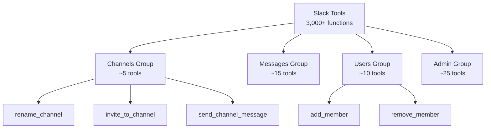

**Walkthrough:** Instead of loading all 3,000 Slack function descriptions, the LLM first identifies the relevant *group* (e.g., "Channels") based on the current task context. Only the tools within that group (~5 tools) are loaded into the context. As the task evolves (e.g., after adding a user to a channel, needing to notify an admin), the LLM can switch groups — loading "Admin" tools while unloading "Channels" tools. JIT instructions from the last tool result can guide the LLM toward the next relevant group.

---

## 7. Model Context Protocol (MCP)

### 7.1 The N × M Problem — Why MCP Exists

Without MCP, connecting N LLMs to M tools requires **N × M** custom integrations:

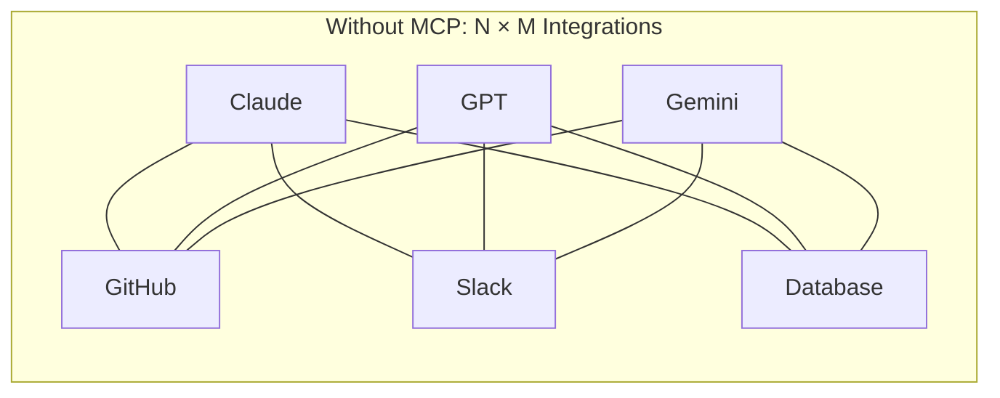

Each LLM handles API calls and responses differently. Switching from Claude to GPT requires rewriting every integration.

With MCP, the problem becomes **N + M**:

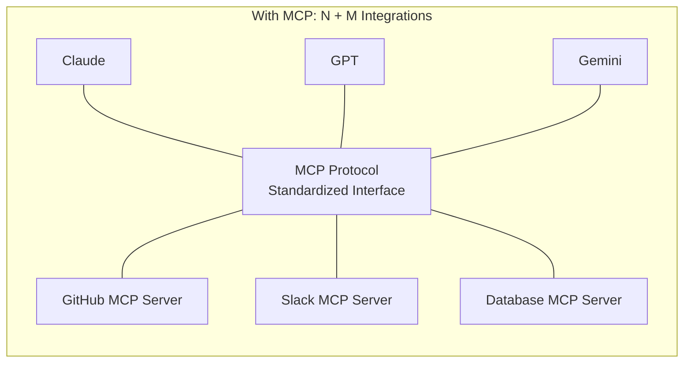

**Walkthrough:** MCP standardizes how instructions are sent to the server and how results are returned. A developer building an MCP server need not worry about which LLM the user will connect — the protocol handles the interface. Similarly, an LLM client (Claude Code, Cursor, etc.) only needs to implement the MCP client protocol once to work with *any* MCP server.

### 7.2 The USB-C Analogy

MCP is to LLM-tool connections what **USB-C** is to hardware connections:

| Before USB-C | After USB-C |
|-------------|-------------|
| Different ports for HDMI, VGA, micro-USB, etc. | One universal port connects to everything |
| Each device needs a specific cable | One cable + adapters for all devices |
| N × M cable combinations | N + M (one port standard + adapters) |

Similarly, MCP standardizes the "port" through which any LLM connects to any tool.

### 7.3 MCP Client vs. MCP Server — Roles Defined

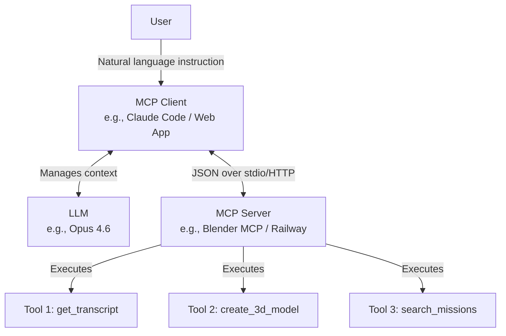

**Walkthrough:** The user communicates with the MCP client (e.g., Claude Code or a web app). The client manages the LLM's context window and orchestrates communication. The LLM decides which tools to call and produces structured tool calls. The client forwards these to the MCP server, which executes the actual tool. Results flow back: Server → Client → LLM → User.

| Component | Role | Key Responsibilities |
|-----------|------|---------------------|
| **MCP Client** | Intermediary between user/LLM and server | Manages LLM's context window; decides what tool schemas to expose to LLM; decides what portion of tool results to feed to LLM; maintains conversation loop with LLM |
| **MCP Server** | Hosts and executes tools | Exposes tool schemas, resources, and prompts; executes tool functions; returns results to client; does NOT manage the LLM's context |
| **LLM** | The reasoning brain | Decides *which* tools to call and in *what order*; produces structured tool call responses; reasons over tool results; produces final natural language output |

> **Key insight:** The LLM *never* communicates directly with the MCP server. All communication flows through the MCP client. The server does not care about or manage the LLM's context window — that is exclusively the client's responsibility.

### 7.4 The Three MCP Primitives

MCP servers expose three types of capabilities (primitives):

| Primitive | Decorator | Description | Example |
|-----------|-----------|-------------|---------|
| **Tools** | `@server.tool` | Functions the LLM can invoke via structured calls | `get_transcript(video_url)`, `search_missions(query, status)` |
| **Resources** | `@server.resource` | Documents exchanged between server and client for later reference | Mission logs, crew schedules, transcripts stored as markdown for RAG |
| **Prompts** | `@server.prompt` | Predefined, reusable system prompts associated with tool actions | "Summarize this transcript in one paragraph", "Create lecture notes from this transcript" |

**Resources** explained: After a tool returns a large result (e.g., a full video transcript), the client can store it as a **resource** — a document that can be queried later via RAG or keyword search without making another server call. For example, a 3-hour lecture transcript stored as a resource can be queried with: "Find the paragraph about RAG" — triggering a RAG retrieval on the stored resource rather than another server call.

**Prompts** explained: Reusable system prompts that define *how* to use tool results. For example, a button labeled "Summarize" triggers a predefined prompt that pairs the transcript resource with a summarization instruction. These are repeatable templates stored on the server side that the client can invoke with a single action (e.g., a button click).

### 7.5 Transport Layer: stdio vs. HTTP/SSE

| Transport | When Used | Example |
|-----------|-----------|---------|
| **stdio** (Standard I/O) | Client and server on the **same device** | Claude Code controlling Blender installed locally |
| **HTTP/HTTPS** | Client and server on **different devices** (over network) | Web app on Vercel communicating with MCP server on Railway |
| **SSE** (Server-Sent Events) | Real-time streaming over network | Streaming tool results as they become available |
| **WebSocket** | Bidirectional real-time communication | Interactive applications requiring constant updates |

### 7.6 The Client-Server Handshake

The MCP initialization is a **three-step handshake**:

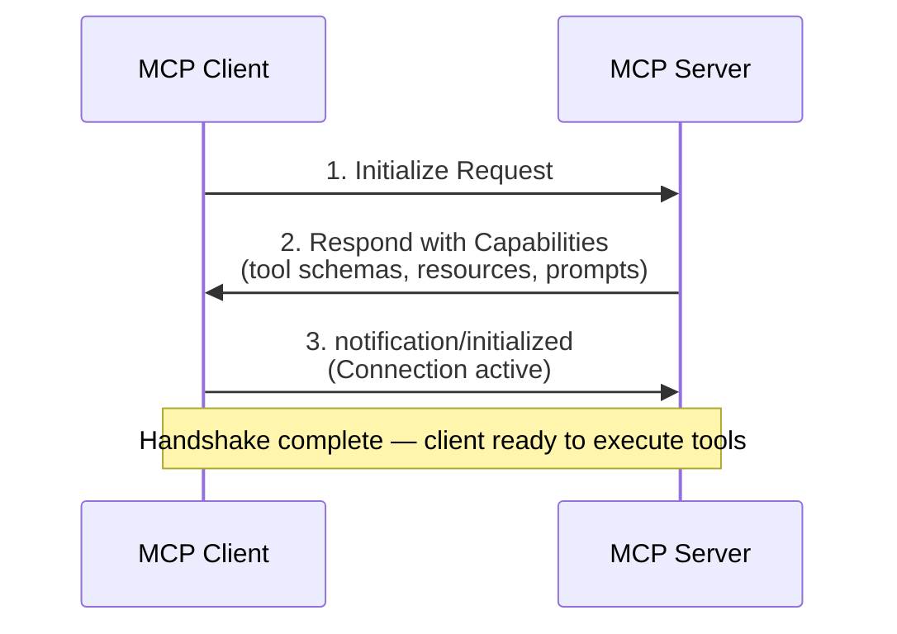

**Walkthrough:** (1) The client sends an `initialize` request to the server. (2) The server responds with its full list of capabilities — all available tool schemas, resources, and prompts. (3) The client confirms initialization, and the connection is active. This handshake is essential because the LLM has no prior knowledge of what tools exist on the server — the handshake provides that discovery.

### 7.7 Tool Call Flow in MCP

After the handshake, individual tool calls follow this pattern:

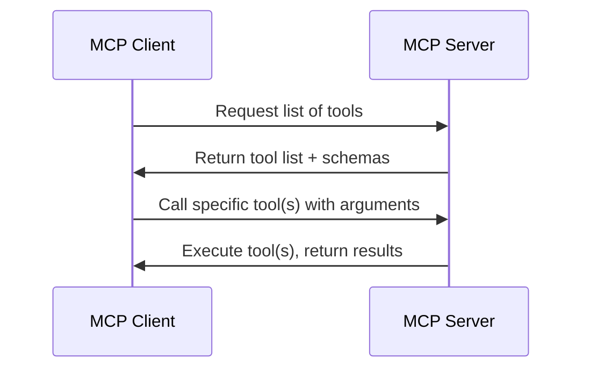

### 7.8 MCP Data Flow — Complete Walkthrough

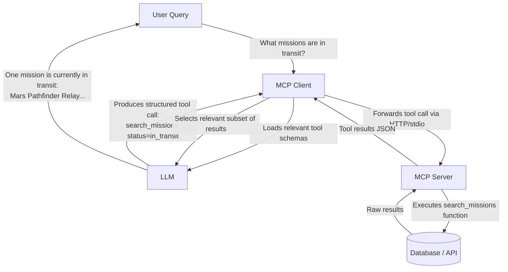

**Walkthrough:** The user asks a question. The client loads the relevant tool schemas into the LLM's context. The LLM produces a structured tool call. The client forwards it to the server. The server executes the function against its data source. Results return to the client. The client decides what portion of the results to feed the LLM (context management). The LLM reasons over the results and produces a natural language answer for the user.

### 7.9 Who Controls the LLM's Context?

| Question | Answer |
|----------|--------|
| Who decides which tool schemas the LLM sees? | **MCP Client** |
| Who decides which tool to call? | **LLM** |
| Who decides the *order* of tool calls? | **LLM** |
| Who executes the tool? | **MCP Server** |
| Where do tool results go first? | **MCP Client** (not directly to the LLM) |
| Who decides what portion of tool results enters the LLM context? | **MCP Client** |
| Who maintains the conversation loop? | **MCP Client** |
| Can the server access the LLM's context? | **No** — the server does not care about or manage the LLM's context |

> **Key insight:** If the MCP server exposes 10 tools but the client sends only 3 tool schemas to the LLM, the LLM can only access those 3 tools. The client is the gatekeeper of what the LLM knows about.

### 7.10 MCP Server Design — Principles and Anti-Patterns

The instructor critiqued a live demo where an MCP server was given LLM access for tasks (summarization, key points) that should have been handled client-side. This led to a clear design principle:

| Principle | Description |
|-----------|-------------|
| **Server does minimum necessary work** | The server should only expose tools that require *server-side resources* (APIs, databases, hardware). Any LLM-based processing belongs on the client. |
| **Server is LLM-agnostic** | The server should not need to know which LLM the client uses. If the server calls an LLM internally, it couples server to provider. |
| **Keep one tool per atomic action** | If a tool can be decomposed into "fetch data" + "process with LLM," only the "fetch data" part belongs on the server. |

**Anti-pattern:** Building tools like `summarize_video` on the server (which internally fetches a transcript *and* calls an LLM) when only `get_transcript` needs to be on the server. Summarization is the client's job — it already has an LLM.

### 7.11 MCP Server Safety and Guardrails

When MCP tools can make destructive changes (e.g., deleting database entries), implement guardrails:

1. **Triple confirmation** — Client-side guardrails requiring 3 user confirmations before delete/edit operations
2. **Eliminate dangerous operations** — Remove delete/edit tools from the server entirely if not needed
3. **Server-side validation** — Tools themselves can reject invalid operations (e.g., refusing to change an "aborted" mission to "completed")
4. **Read-only by default** — MCP servers for sensitive systems should default to read-only; write access requires explicit, guarded tools

> **Key insight:** The client-server architecture helps with safety — the client provides guardrails *before* instructions reach the server, and the server can provide guardrails via tool-level validation. Defense in depth.

### 7.12 Key Conceptual Clarifications (Quiz)

Selected quiz questions and their explanations from the interactive session:

**Q: If an MCP server exposes a tool but the LLM never sees the tool schema, what happens?**
A: The LLM cannot use the tool. The LLM has no awareness of the tool's existence unless the client communicates the schema.

**Q: Who decides when to invoke a tool vs. when to include a resource?**
A: The **LLM** decides when to invoke tools (it's the "brain"). The **client** decides when to include resources in the LLM's context.

**Q: An MCP server exposes 15 tools with detailed descriptions. What is the main risk?**
A: Context rot. Loading all 15 tool descriptions consumes significant tokens and may degrade LLM output quality if the context becomes bloated.

**Q: Does everything from the MCP server count as output tokens?**
A: No. The MCP client ultimately decides what goes into the LLM's token context. Server results go to the client first, and the client controls what subset reaches the LLM.

**Q: Can RAG be wrapped in a tool call?**
A: Yes. RAG has no inherent dependency on the LLM — it is a retrieval mechanism (query → embed → similarity → retrieve). A tool function can implement RAG internally: accept a query, run vector retrieval, and return the top-K chunks as the tool result.

---

## 8. Just-In-Time (JIT) Instructions

### 8.1 The Problem JIT Solves

If you have 50–100 tools, loading all their detailed usage instructions into the system prompt creates massive context bloat. JIT instructions solve this by delivering tool-specific guidance **only when that tool's results are being processed**. Anthropic (or Shopify — the instructor recalled both as pioneers) introduced this pattern.

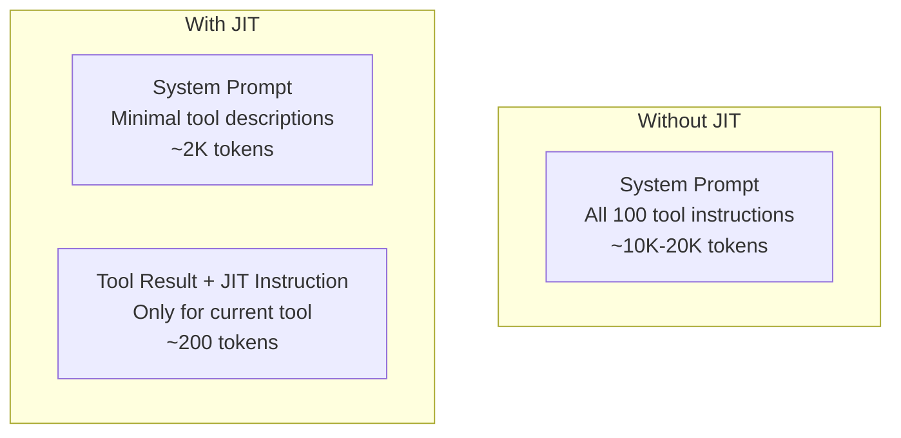

### 8.2 JIT in Tool Results (Server → Client)

The MCP server embeds deterministic instructions alongside tool results using if/else logic:

```json
{
  "result": {
    "fuel_kg": 52500,
    "cost_usd": 2625000,
    "safety_margin": 0.15
  },
  "jit_instructions": "IMPORTANT: When presenting fuel estimates, always note that 15% safety margin is already included. If fuel > 50,000 kg, warn that this requires a heavy-lift vehicle. Present cost in millions (e.g., $2.6 million). Suggest checking weather at the launch site."
}
```

**How it works:** The server uses deterministic if/else conditions to select the appropriate JIT instruction. If fuel > 50,000 kg → include heavy-lift warning. If fuel < 10,000 kg → include light-payload note. This is not LLM-based — it's keyword/threshold logic on the server side.

### 8.3 JIT in Tool Calls (Client → Server)

The LLM can also embed JIT instructions in its tool call to tell the server to filter its response:

```json
{
  "tool": "search_missions",
  "arguments": { "status": "in_transit" },
  "jit_instructions": "Return only parameter A and parameter B"
}
```

**Effect:** Instead of the server returning 500 values from 10 tools (10 × 50), the JIT instruction tells the server to return only 20 values (10 × 2). The client receives a pre-filtered response and can directly pass it to the LLM without additional filtering logic.

### 8.4 JIT Concrete Example — Fuel Estimation

```json
{
  "tool_result": {
    "fuel_kg": 52500,
    "cost_usd": 2625000,
    "safety_margin": 0.15
  },
  "jit_instructions": "IMPORTANT: 15% safety margin already included. Fuel > 50,000 kg requires heavy-lift vehicle. Present cost as $2.6 million. Suggest checking weather at launch site."
}
```

For a weather tool:

```json
{
  "tool_result": {
    "location": "Cape Canaveral",
    "condition": "Partly Cloudy",
    "wind_speed_kmh": 18,
    "launch_safe": true
  },
  "jit_instructions": "If launch_safe is false: CRITICAL — do not suggest waiting for weather to clear. Policy requires 48-hour clear forecast. Recommend postponement and monitoring."
}
```

**Safety-critical tools:** For safety-critical applications, put instructions in **both** the tool schema description (static guidance) **and** JIT results (dynamic, condition-dependent guidance). For example: the schema says "always verify fuel sufficiency before recommending launch." The JIT instruction provides specific thresholds based on the actual returned value.

### 8.5 When JIT Is Needed vs. Not

| Scenario | JIT Needed? | Rationale |
|----------|------------|-----------|
| 5–10 tools | **No** | Include full descriptions in system prompt (~500–1,000 tokens) |
| 50–100 tools | **Yes** | Loading all descriptions causes context bloat; use JIT for active tools only |
| Safety-critical tools | **Both** | JIT in results for dynamic guidance + schema description for static safety rules |
| Simple data retrieval | **No** | Result is self-explanatory; no additional interpretation guidance needed |

> **Key insight:** Modern coding agents like Claude Code already handle context management well — you may not need to implement JIT manually for small-to-medium tool sets. JIT becomes essential at scale (100+ tools) or for safety-critical applications.

---

## 9. The ReAct Pattern — Reasoning + Acting

### 9.1 The ReAct Loop Explained

**ReAct** (Reasoning + Acting) is an agent loop pattern where the LLM alternates between explicit **thought** (reasoning) steps and **action** (tool call) steps, with **observation** (tool result) feeding back into the next thought. This framework was popularized in mid-2025.

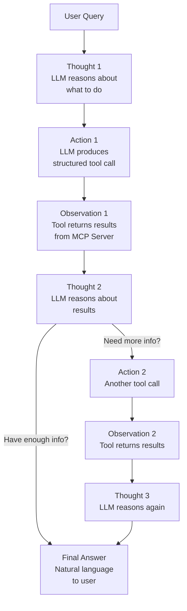

**Walkthrough:** The loop runs as follows: (1) **Thought** — the LLM reasons about what information it needs and which tool to call. (2) **Action** — the LLM produces a structured tool call. (3) **Observation** — the tool result (from the MCP server, via the client) is injected into the LLM's context. (4) The LLM then reasons again (next Thought), possibly calling another tool or producing the final answer. The loop can run 2, 3, or more times depending on task complexity.

> **Key insight:** ReAct requires a model with internal reasoning capability. Regular models may keep relaying output to the user instead of entering the thought-action-observation cycle. Reasoning-capable models (Claude, GPT-o series) handle this naturally.

### 9.2 Single-Step ReAct Example

**User query:** "What missions are currently in transit?"

| Step | Type | Content |
|------|------|---------|
| 1 | **Thought** | "The user wants to know about missions currently in transit. I should search for missions with status = in_transit." |
| 2 | **Action** | `search_missions(query="in transit", status="in_transit")` |
| 3 | **Observation** | `[{ "id": "M005", "name": "Mars Pathfinder Relay", "status": "in_transit", "destination": "Mars", "crew": ["Chen", "Okafor"] }]` |
| 4 | **Thought** | "I found one mission in transit: Mars Pathfinder Relay. I have all the details to answer." |
| 5 | **Answer** | "There is currently one mission in transit: Mars Pathfinder Relay, headed to Mars with crew members Chen and Okafor." |

### 9.3 Multi-Step ReAct Example

**User query:** "Can we launch ISS Supply Delta on March 10th? Check the weather and cargo weight, then estimate fuel."

| Step | Type | Content |
|------|------|---------|
| 1 | **Thought** | "User wants to know if mission M00003 can launch on March 10th. I need to: (1) check weather, (2) get cargo manifest for total weight, (3) estimate fuel." |
| 2 | **Action** | `get_weather_forecast(location="Cape Canaveral", date="2026-03-10")` |
| 3 | **Observation** | `{ "condition": "Partly Cloudy", "wind_speed": 18, "launch_safe": true }` |
| 4 | **Thought** | "Weather is good, launch is safe. Now I need to check the cargo manifest." |
| 5 | **Action** | `get_cargo_manifest(mission_id="M00003")` |
| 6 | **Observation** | `{ "total_weight_kg": 435, "items": [...] }` |
| 7 | **Thought** | "Cargo total is 435 kg. Now I can estimate fuel for this payload to ISS." |
| 8 | **Action** | `calculate_fuel_estimate(mission_id="M00003", destination="ISS", cargo_kg=435)` |
| 9 | **Observation** | `{ "fuel_kg": 52500, "cost_usd": 2625000, "safety_margin": 0.15 }` |
| 10 | **Thought** | "Mission is safe: weather clear, cargo loaded, fuel estimated. Ready to answer." |
| 11 | **Answer** | "Yes, ISS Supply Delta can launch on March 10th. Weather is clear at Cape Canaveral, cargo is 435 kg, and estimated fuel is 52,500 kg (~$2.6 million with 15% safety margin included)." |

> **Key insight:** The thought step between each action is critical. After checking weather, the LLM reasoned that weather is safe — if it had been unsafe, the LLM would skip the cargo and fuel checks entirely, saving tokens and unnecessary tool calls.

### 9.4 ReAct with Error Handling

**User query:** "Update the Venus Atmosphere Probe mission to completed status."

| Step | Type | Content |
|------|------|---------|
| 1 | **Thought** | "User wants to update a mission status. First let me find the mission ID." |
| 2 | **Action** | `search_missions(query="Venus Atmosphere Probe")` |
| 3 | **Observation** | `{ "id": "M008", "name": "Venus Atmosphere Probe", "status": "aborted" }` |
| 4 | **Thought** | "Found it: M008. Current status is aborted. Let me try to update it to completed." |
| 5 | **Action** | `update_mission_status(mission_id="M008", status="completed")` |
| 6 | **Observation** | `{ "success": false, "error": "Invalid status transition. Cannot move from 'aborted' to 'completed'. Allowed transitions from 'aborted': none." }` |
| 7 | **Thought** | "The update failed because 'aborted' is a terminal state. No further action is possible." |
| 8 | **Answer** | "I cannot update mission M008 (Venus Atmosphere Probe). The mission status is 'aborted', which is a terminal state — it cannot be changed to 'completed' or any other status." |

### 9.5 Why the Thought Step Matters

Without the thought step, an agent with JIT instructions can still produce incorrect responses:

**Scenario:** A weather tool returns `launch_safe: false`. The JIT instruction says: "CRITICAL: Do not suggest waiting for weather to clear. Policy requires 48-hour clear forecast."

| With Thought Step | Without Thought Step |
|------------------|---------------------|
| LLM reasons: "JIT says I need a 48-hour clear forecast. I should call the extended forecast tool before responding." | LLM sees `launch_safe: false` → immediately outputs: "Weather is bad, but you could try again in a few hours." |
| **Correct behavior** — makes another tool call for the 48-hour forecast | **Wrong behavior** — skipped the JIT constraint entirely |

> **Key insight:** The explicit thought step forces the LLM to process JIT instructions and tool results *before* deciding on the next action. Without it, the LLM may skip critical constraints and produce incorrect outputs. The thought tokens consume more context but are of extremely high value — they improve the LLM's own context for the next decision.

### 9.6 Token Consumption Trade-Off

| Aspect | Without ReAct | With ReAct |
|--------|-------------|-----------|
| Token usage | Lower — single action + response | **3–5× higher** — thought + action + observation per loop |
| Accuracy | Lower — may miss constraints, make premature responses | **Higher** — each step is reasoned; errors are caught early |
| Use case | Simple, single-tool queries | **Mission-critical**, multi-step tasks requiring reliable reasoning |

> **Key insight:** Tracking cumulative token consumption across a ReAct chain matters. Each loop adds thought tokens + tool result tokens. In the multi-step example above (weather → cargo → fuel), three full loops could consume significant context. If the context window fills, results may get truncated or context rot may degrade reasoning quality.

---

## 10. Multi-Agent Architecture: The Central Brain Pattern

This pattern was previewed in Day 3 during the discussion of persistent memory and is covered here in full because it relies fundamentally on **two-way MCP** — the protocol mechanism covered in this lecture.

### 10.1 The Problem — Isolated Agents

In a real-world company, multiple specialized agents may exist as **separate projects** (not sub-agents — fully independent codebases):

- **Agent 1 (Research):** Searches the web, analyzes papers, compiles findings
- **Agent 2 (Email):** Drafts and sends emails, manages inbox
- **Agent 3 (Code Review):** Reviews pull requests, checks code quality
- **Agent 4 (Data Analysis):** Queries databases, generates reports

Each agent excels at its specialty but has **no awareness of the other agents or the overall company workflow**. Agent 1 does not know when Agent 2 should send a follow-up email. Agent 3 does not know that Agent 4's report is a prerequisite for a code change.

### 10.2 Architecture — Central Brain as Orchestrator

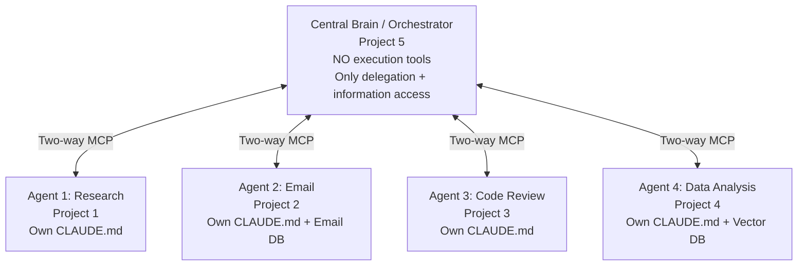

**Walkthrough:** Five separate projects exist — four specialized agents and one Central Brain orchestrator. The Central Brain (Project 5) connects to each agent via **two-way MCP**, meaning communication flows in both directions. The Central Brain has **no execution tools of its own** — it cannot research, email, review code, or analyze data directly. Its only capabilities are (1) accessing information about each agent's status and capabilities, and (2) delegating tasks to the appropriate agent.

### 10.3 Why Not Connect Agents Directly?

A student asked: "Why can't we directly connect each project through two-way MCP?"

Individual agents lack the global context to know *when* and *what* to do — they only know *how*:

| Component | Knows "How" | Knows "When" and "What" |
|-----------|------------|------------------------|
| Agent 1 (Research) | ✅ How to search, analyze, compile | ❌ When research is needed, what to research next |
| Agent 2 (Email) | ✅ How to draft and send emails | ❌ When to send, what context to include |
| Central Brain | ❌ Cannot execute any task itself | ✅ Knows overall company workflow, priorities, and task dependencies |

> **Key insight:** The Central Brain holds the **global picture** — what projects are in progress, what tasks are pending, what dependencies exist. Individual agents are focused specialists. The Central Brain provides *instructions*; individual agents provide *execution*. This separation is the same pattern as the MCP client-server split — the orchestrator (like the client) decides *what* to do; the agents (like the server) decide *how* to do it.

### 10.4 Role Separation: Instructions vs. Execution

| Role | Central Brain (Orchestrator) | Specialized Agents |
|------|-----------------------------|--------------------|
| **Has tools for** | Information access, delegation, scheduling | Domain-specific execution (email, research, code, data) |
| **Makes decisions about** | Task ordering, agent selection, workflow dependencies | How to accomplish a specific assigned task |
| **Context includes** | `CLAUDE.md` files from all agents, global task board, company priorities | Only its own `CLAUDE.md`, domain-specific databases, current assignment |
| **MCP role** | Acts as MCP **client** to each agent's MCP server | Acts as MCP **server** exposing its tools to the Central Brain |

### 10.5 Shared Context Across Agents

Certain files are referenced across the entire multi-agent network:

- **`CLAUDE.md` files from each agent** — Referenced by the Central Brain to understand each agent's core philosophy, capabilities, and implementation strategy. These are **persistent memory** (weeks/months lifespan).
- **Shared databases** — e.g., an email agent's vector database may be queried by both the email agent and the Central Brain for different purposes.
- **Task state** — The Central Brain maintains a global understanding of which tasks are assigned, pending, or completed across all agents.

> **Key insight:** The `CLAUDE.md` file is the contract between an agent and the Central Brain. It tells the orchestrator: "Here is what I can do, here are my constraints, and here is my operating philosophy." The Central Brain reads these files to make informed delegation decisions — it never needs to understand the agent's implementation details.

### 10.6 Central Brain and MCP — The Connection

The Central Brain pattern is a natural extension of everything covered in this lecture:

| MCP Concept | Central Brain Application |
|-------------|--------------------------|
| **MCP Client** | Central Brain acts as client to each agent |
| **MCP Server** | Each specialized agent acts as a server exposing its tools |
| **Three Primitives** | Agents expose tools (execute tasks), resources (`CLAUDE.md`, databases), and prompts (standard task templates) |
| **Two-way MCP** | Bidirectional: Central Brain delegates *to* agents; agents report status *back* to the Central Brain |
| **Transport** | stdio if all agents are on the same machine; HTTP/SSE if agents are distributed across servers |
| **Handshake** | Central Brain discovers each agent's capabilities during initialization — just like any MCP client-server handshake |
| **Tool selection** | Central Brain's LLM decides which agent to delegate to — the same "Decide" step from the tool life cycle pipeline |

---

## Implementation Notes

- **FastMCP** — Python library for implementing MCP servers; handles protocol, transport, and handshake automatically
- **Vercel** — Common hosting for MCP client (web frontend)
- **Railway** — Common hosting for MCP server (Python backend)
- **Blender MCP** — Built-in plugin for Blender 4.4.3+; starts MCP server on a local port; communicates via stdio
- **GitHub: awesome-mcp-servers** — Repository with 89K+ stars cataloging MCP servers for various tools and services
- **PaperBanana** — Google Cloud AI Research tool using iterative ReAct loops to generate publication-quality figures; available via `pip install paperbanana`
- **YouTube Transcript API** — `youtube_transcript_api` Python package; fetches transcripts without requiring a YouTube API key
- **Claude Code and modern coding agents** handle context management automatically for most use cases — JIT is needed primarily at scale (100+ tools)

---

## Key Takeaways

- LLMs have three fundamental limitations (no live data, unreliable computation, no real-world effects) — tools solve all three
- LLMs do NOT execute tools — they produce structured tool calls; the tool's own logic runs the function
- Tool schemas must be well-designed: verb-noun naming, clear descriptions, enumerated constraints, required vs. optional parameters, return descriptions
- MCP standardizes LLM-tool communication, reducing the N × M integration problem to N + M
- The MCP client is the gatekeeper of the LLM's context — it controls what tool schemas and results the LLM sees
- The MCP server executes tools and returns results but has no knowledge of or control over the LLM's context
- MCP servers should do the minimum necessary work — LLM-based processing belongs on the client side
- Three MCP primitives: tools (functions), resources (documents), prompts (reusable templates)
- Transport: stdio for local (same device), HTTP/SSE for remote (over network)
- JIT instructions reduce context bloat by delivering tool-specific guidance only when needed — essential at 100+ tool scale
- The ReAct pattern (Thought → Action → Observation → loop) enables multi-step reasoning with explicit thought steps
- The thought step is critical — without it, LLMs skip JIT constraints and produce incorrect outputs
- ReAct costs 3–5× more tokens but is essential for mission-critical, multi-step tasks
- The Central Brain pattern uses two-way MCP to orchestrate multiple specialized agents — the orchestrator provides instructions, agents provide execution

---

## Glossary

| Term | Definition | First Introduced |
|------|-----------|-----------------|
| **Tool** | An external function or API that an LLM can invoke to access data, perform computation, or take real-world actions | Section 3 |
| **Tool Schema** | A JSON description of a tool's name, purpose, parameters, and return format — enables the LLM to decide how to call it | Section 4 |
| **MCP (Model Context Protocol)** | A standardized protocol for LLM-tool communication; any LLM can connect to any tool via a common interface | Section 7 |
| **MCP Client** | The intermediary that manages the LLM's context, forwards tool calls to the server, and controls what the LLM sees | Section 7.3 |
| **MCP Server** | Hosts and executes tools; exposes tools, resources, and prompts to the client | Section 7.3 |
| **MCP Primitives** | The three types of capabilities an MCP server exposes: tools, resources, and prompts | Section 7.4 |
| **stdio** | Standard I/O transport protocol for local (same-device) client-server communication | Section 7.5 |
| **Handshake** | The three-step initialization protocol between MCP client and server to discover available tools | Section 7.6 |
| **JIT Instructions** | Just-In-Time instructions embedded in tool results or tool calls to provide context-efficient guidance | Section 8 |
| **ReAct** | Reasoning + Acting — an agent loop pattern alternating between thought, action, and observation steps | Section 9 |
| **Central Brain** | An orchestrator agent that delegates tasks to specialized agents via two-way MCP; holds global context but has no execution tools | Section 10 |
| **Two-way MCP** | Bidirectional MCP communication where both parties can send and receive; enables the Central Brain pattern | Section 10.6 |
| **FastMCP** | Python library for implementing MCP servers with minimal boilerplate | Implementation Notes |
| **Snake Case** | Naming convention using underscores: `search_missions` (preferred for tool names) | Section 4.2 |
| **PaperBanana** | Google Cloud AI Research tool using iterative ReAct loops to generate publication-quality figures | Section 9.6 |

---

## Notation Reference

| Symbol / Term | Meaning |
|--------------|---------|
| N × M | Number of custom integrations without MCP (N LLMs × M tools) |
| N + M | Number of integrations with MCP (N LLM clients + M MCP servers) |
| ReAct | Reasoning + Acting (agent loop pattern) |
| JIT | Just-In-Time (instructions delivered dynamically, not preloaded) |
| stdio | Standard Input/Output (local transport) |
| SSE | Server-Sent Events (streaming transport) |
| WSCI | Write-Select-Compress-Isolate (context engineering framework from Day 3) |
| `@server.tool` | MCP decorator for exposing a function as a tool |
| `@server.resource` | MCP decorator for exposing a document as a resource |
| `@server.prompt` | MCP decorator for exposing a reusable prompt template |

---

## Connections to Other Topics

| Topic | Connection |
|-------|-----------|
| **Day 1: Six Core Elements** | Tool definitions and tool outputs are Element 4 of the context window; tools compete for token budget with RAG, system prompts, and history |
| **Day 2: CLAUDE.md & System Prompts** | Tool descriptions can be included in system prompts for small tool sets; for large sets, use RAG-based tool selection. `CLAUDE.md` files are the contract between agents in the Central Brain pattern. |
| **Day 3: RAG & WSCI Framework** | RAG is the *Select* operation; tools are the *Action* capability; tool results contribute to context that may need *Compression*; sub-agent tool calls use *Isolation*. RAG can also be used to select which tool schemas to load. |
| **Day 3: Context Rot** | Too many tool descriptions cause context rot; JIT instructions and grouped tool loading are mitigation strategies |
| **Day 3: Memory Lifetimes** | Central Brain pattern relies on persistent memory (`CLAUDE.md` files referenced for weeks/months); ReAct loop observations are ephemeral (used in current chain only) |
| **Day 3: Central Brain Preview** | Day 3 introduced the Central Brain concept in the context of memory architecture; Day 4 provides the full technical mechanism (two-way MCP) that makes it work |
| **Agent Engineering** | ReAct is the foundational agent loop pattern; Plan-and-Execute and more complex patterns build on the thought-action-observation cycle |

---

## Open Questions / Areas for Further Study

- **MCP Host vs. MCP Client distinction** — The instructor noted this is "an ongoing discussion" in the community; the terms are sometimes used interchangeably but may have subtle differences
- **MCP Security** — How to prevent unauthorized tool execution; authentication between client and server; rate limiting on MCP servers
- **Dynamic tool schema compression** — Can tool descriptions themselves be RAG-retrieved and compressed for token efficiency?
- **ReAct vs. Plan-and-Execute** — When should an agent plan all steps upfront vs. reason step-by-step? What are the trade-offs?
- **Multi-agent MCP topologies** — How do multiple agents share MCP servers? Can agents communicate with each other via MCP without a central brain?
- **Central Brain scalability** — How does the orchestrator handle 10+ agents? Does it need its own tool selection / RAG mechanism for choosing which agent to delegate to?
- **MCP versioning and backward compatibility** — How does the protocol handle server updates that change tool schemas?
- **Autonomous ReAct loops** — How many iterations should be allowed before forcing a response? What are good stopping criteria?
- **Two-way MCP implementation** — Detailed protocol for bidirectional communication; how does state synchronization work between orchestrator and agents?
